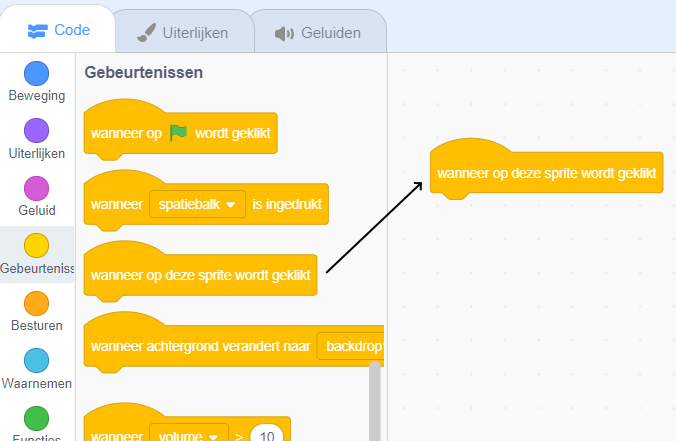
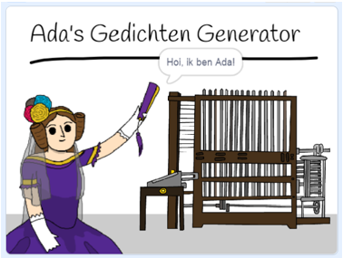

## Ada Lovelace

In 1842 schreef Ada Lovelace over het gebruik van een machine genaamd de 'Analytische Machine' om berekeningen te maken, en ze wordt het gezien als 's werelds eerste computerprogrammeur! Ada was ook de eerste die zag dat computers meer konden zijn dan alleen grote rekenmachines.

--- task ---

Open het Scratch startproject 'Poetry Generator'.

**Online**: open het [starter project](https://scratch.mit.edu/projects/381619826){:target="_blank"}.

Als je een Scratch account hebt, kun je een kopie maken door op **Remix** te klikken.

**Offline**: open het [startproject](http://rpf.io/p/nl-NL/poetry-go){:target="_blank"} in de offline editor.

Als je de Scratch offline editor wilt downloaden en installeren dan kan je die vinden op [rpf.io/scratchoff](http://rpf.io/scratchoff){:target="_blank"}.

--- /task ---

--- task ---

Klik op de 'Ada' sprite en klik op het tabblad `Gebeurtenissen`{:class="block3events"} in het blokkentabblad. Sleep het `wanneer op deze sprite wordt geklikt`{:class="block3events"} blok naar het midden.




Alle code die onder dit blok wordt toegevoegd, wordt uitgevoerd wanneer op Ada wordt geklikt!

--- /task ---

--- task ---

Klik op het tabblad `Uiterlijken`{:class="block3looks"} en sleep het `zeg`{:class="block3looks"} `Hoi!` `2 sec.`{:class="block3looks"} blok onder het `wanneer op deze sprite wordt geklikt`{:class="block3events"} blok dat je al hebt toegevoegd.


```blocks3
wanneer op deze sprite wordt geklikt
zeg [Hoi!] (2) sec.
```

--- /task ---

--- task ---

Klik op Ada en je zou haar tegen je moeten zien praten.



--- /task ---