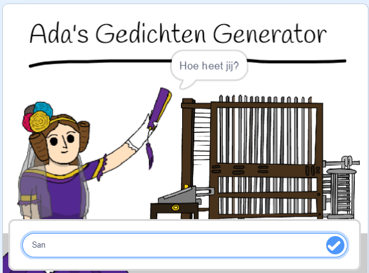
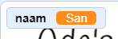
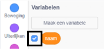
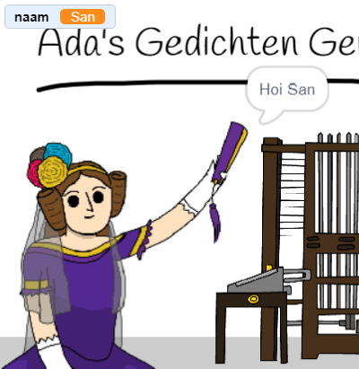

## Ada je naam vertellen

Ada heeft zichzelf voorgesteld, maar ze kent je naam niet!

\--- task \---

Sleep een `vraag`{:class="block3sensing"} blok (uit de sectie `waarnemen`{:class="block3sensing"}) naar je code. Zo zou de code eruit moeten zien:


```blocks3
wanneer op deze sprite wordt geklikt
zeg [Hoi, ik ben Ada!] (2) sec.
+ vraag [Hoe heet jij?] en wacht
```

\--- /task \---

\--- task \---

Klik op Ada om de code te testen. Ada zou om je naam moeten vragen, die je kunt typen!



\--- /task \---

\--- task \---

We kunnen een **variabele** gebruiken om je naam op te slaan. Klik op `Variabelen`{:class="block3variables"} en vervolgens op 'Maak een variabele'. Omdat deze variabele wordt gebruikt om naam op te slaan, noemen we de variabele... `naam`{:class="block3variables"}!

[[[generic-scratch3-add-variable]]]

\--- /task \---

\--- task \---

Om je naam op te slaan, klik je op het tabblad `Variabelen`{:class="block3variables"} en sleep je vervolgens het blok `maak naam`{:class="block3variables"} naar het einde van de code.


```blocks3
wanneer op deze sprite wordt geklikt
zeg [Hoi, ik ben Ada!] (2) sec.
vraag [Hoe heet jij?] en wacht
+ maak [naam v] [0]
```

\--- /task \---

\--- task \---

Gebruik het blok `antwoord`{:class="block3sensing"} om het antwoord op te slaan dat je typt.


```blocks3
wanneer op deze sprite wordt geklikt
zeg [Hoi, ik ben Ada!] (2) sec.
vraag [Hoe heet jij?] en wacht
maak [naam v] (antwoord :: +)
```

\--- /task \---

\--- task \---

Klik op Ada om de code te testen en voer je naam in wanneer daarom wordt gevraagd. Je zou moeten zien dat je naam is opgeslagen in de variabele `naam`{:class="block3variables"}.



\--- /task \---

\--- task \---

Je kunt nu jouw naam gebruiken in je code. Voeg deze code toe:


```blocks3
wanneer op deze sprite wordt geklikt
zeg [Hoi, ik ben Ada!] (2) sec.
vraag [Hoe heet jij?] en wacht
maak [naam v] (antwoord)
+ zeg (voeg [Hoi ] en (naam) samen) (2) sec. 
```

Om deze code te maken:

1. Sleep een `voeg samen`{:class="block3operators"} blok naar het `zeg`{:class="block3looks"} blok
    
    ```blocks3
    zeg (voeg [appel] en [banaan] samen :: +) (2) sec.
    ```

2. Voeg je `naam`{:class="block3data"} blok toe aan het `voeg samen`{:class="block3operators"} blok.
    
    ```blocks3
    zeg (voeg [Hoi] en (naam :: variabelen +) samen) (2) sec.
    ```

\--- /task \---

\--- task \---

To hide your `name`{:class="block3variables"} variable on the stage, click the tick next to the variable.



\--- /task \---

\--- task \---

Test your new code. Ada should say hello to you, using your name!



If there's no space between the word 'Hi' and your name, you'll need to add a space into the code yourself!

\--- /task \---

\--- task \---

Finally, add this code to explain what to do next:


```blocks3
wanneer op deze sprite wordt geklikt
zeg [Hoi, ik ben Ada!] (2) sec.
vraag [Hoe heet jij?] en wacht
maak [naam v] (antwoord)
zeg (voeg [Hoi ] en (naam) samen) (2) sec. 
+ zeg [Klik op de computer om een gedicht te maken!] (2) sec. 
```

\--- /task \---

\--- task \---

Test Ada's code one last time, to make sure that everything works.

\--- /task \---