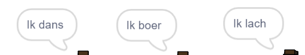

## De analytische machine

Laten we Ada's computer (de 'Analytical Engine' of de 'Analytische Machine' genoemd) programmeren om poëzie te genereren.

\--- task \---

Voeg deze code toe aan de 'Computer' sprite, zodat deze spreekt wanneer erop wordt geklikt:


```blocks3
wanneer op deze sprite wordt geklikt
zeg [Hier is je gedicht ...] (2) sec.
```

\--- /task \---

\--- task \---

Om een willekeurig gedicht te maken, heb je eerst een **lijst** met woorden nodig om te gebruiken. Klik op het tabblad `Variabelen`{:class="block3variables"} om een nieuwe lijst te maken.

Laten we **werkwoorden** gebruiken in de eerste regel van je gedicht. Maak een nieuwe lijst met de naam `werkwoorden`{:class="block3variables"}.

[[[generic-scratch3-make-list]]]

\--- /task \---

\--- task \---

Je nieuwe lijst is leeg. Klik op `+` onderaan de lege lijst en voeg deze werkwoorden toe:


\--- /task \---

\--- task \---

De eerste regel van je gedicht moet het woord "Ik" zijn, gevolgd door een willekeurig werkwoord.

Om deze zin te maken, moet je:

1. `willekeurig getal`{:class="block3operators"} tussen `1` en de `lengte van werkwoordenlijst`{:class="block3variables"}:
    
    ```blocks3
    (willekeurig getal tussen (1) en (lengte van [werkwoorden v]))
    ```

2. Gebruik dit blok om een willekeurig `item`{:class="block3variables"} te krijgen uit de `werkwoorden`{:class="block3variables"} lijst:
    
    ```blocks3
    (item (willekeurig getal tussen (1) en (lengte van [werkwoorden v]) :: +) van [werkwoorden v])
    ```

3. `Voeg`{:class="block3operators"} "Ik" samen met het willekeurige werkwoord om de eerste regel van je gedicht te maken:
    
    ```blocks3
    (voeg [Ik ] (item (willekeurig getal tussen (1) en (lengte van [werkwoorden v] samen)) van [werkwoorden v] :: +))
    ```

4. Gebruik een `zeg`{:class="block3looks"} blok om de poëzieregel weer te geven:
    
    ```blocks3
    zeg (voeg [Ik ] (item (willekeurig getal tussen (1) en (lengte van [werkwoorden v] samen)) van [werkwoorden v]) :: +) (2) sec.
    ```

Je code zou er als volgt uit moeten zien:


```blocks3
when this sprite clicked
say [Here is your poem...] for (2) seconds
+ say (join [I ](item (pick random (1) to (length of [verbs v])) of [verbs v])) for (2) seconds
```

\--- /task \---

\--- task \---

Test je code een paar keer. Je computer moet elke keer een willekeurig woord kiezen uit de lijst `werkwoorden`{:class="block3variables"}.



\--- /task \---