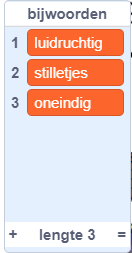
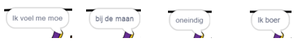
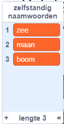
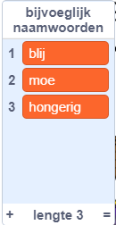
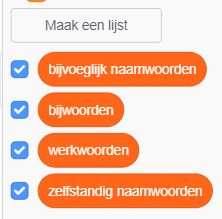

## Meer poëzie

Je gedicht is vrij kort - laten we er wat aan toevoegen!

\--- task \---

Laten we bijwoorden in de volgende regel van je gedicht gebruiken. Een **bijwoord** is een woord dat een werkwoord beschrijft. Maak nog een lijst met als naam bijwoorden en voeg deze 3 woorden toe:



\--- /task \---

\--- task \---

Voeg deze regel toe aan de code van de computer, om een willekeurig bijwoord op de volgende regel van je gedicht te zeggen:


```blocks3
wanneer op deze sprite is geklikt
zeg [Hier is je gedicht ...] gedurende (2) seconden
zeg (voeg [Ik ] en (item (kies willekeurig (1) tot (lengte van [werkwoorden v])) van [werkwoorden v] ) samen) gedurende (2) seconden
+ zeg (item (kies willekeurig (1) tot (lengte van [bijwoorden v])) van [bijwoorden v]) gedurende (2) seconden
```

\--- /task \---

\--- task \---

Test je code een paar keer. Je zou elke keer een willekeurig gedicht moeten zien.



\--- /task \---

\--- task \---

Voeg een lijst met zelfstandige naamwoorden toe aan je project. Een **zelfstandig naamwoord** is een plaats of een ding.



\--- /task \---

\--- task \---

Voeg code toe om de zelfstandige naamwoorden in je gedicht te gebruiken.


```blocks3
wanneer op deze sprite wordt geklikt
zeg [Hier is je gedicht ...] (2) sec.
zeg (voeg [Ik ] en (item (willekeurig getal tussen (1) en (lengte van [werkwoorden v])) van [werkwoorden v] samen)) (2) sec.
zeg (item (willekeurig getal tussen (1) en (lengte van [bijwoorden v])) van [bijwoorden v]) (2) sec.
+ zeg (voeg [bij de] (item (willekeurig getal tussen (1) en (lengte van [zelfstandige naamwoorden v])) en [zelfstandige naamwoorden v] samen)) (2) sec.
```

\--- /task \---

\--- task \---

Voeg een lijst met bijvoeglijke naamwoorden toe aan je project. Een **bijvoeglijk naamwoord** is een beschrijvend woord.



\--- /task \---

\--- task \---

Voeg code toe om de bijvoeglijke naamwoorden in je gedicht te gebruiken:


```blocks3
wanneer op deze sprite wordt geklikt
zeg [Hier is je gedicht ...] (2) sec.
zeg (voeg [Ik ] en (item (willekeurig getal tussen (1) en (lengte van [werkwoorden v])) van [werkwoorden v] samen)) (2) sec.
zeg (item (willekeurig getal tussen (1) en (lengte van [bijwoorden v])) van [bijwoorden v]) (2) sec.
zeg (voeg [door de] (item (willekeurig getal tussen (1) en (lengte van [zelfstandige naamwoorden v] samen)) en [zelfstandige naamwoorden v] samen)) (2) sec.
+ zeg (voeg [Ik voel me] (item (willekeurig getal tussen (1) en (lengte van [bijvoeglijke naamwoorden v)])) en [bijvoeglijke naamwoorden v] samen)) (2) sec.
```

\--- /task \---

\--- task \---

Je kunt op de vakjes naast je lijsten klikken om ze te verbergen.



\--- /task \---

\--- task \---

Test je nieuwe gedicht.

\--- /task \---