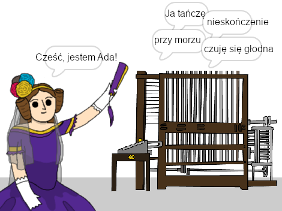

--- no-print ---

To jest wersja projektu korzystająca z **Scratch 3**. Istnieje również [wersja tego projektu dla Scratch 2](https://projects.raspberrypi.org/en/projects/poetry-generator-scratch2).

--- /no-print ---

## Wprowadzenie

Nauczysz się programować własny generator poezji!

--- no-print ---

  <iframe allowtransparency="true" width="485" height="402" src="https://scratch.mit.edu/projects/embed/382663646/?autostart=false" frameborder="0" scrolling="no"></iframe>
  

--- /no-print ---

--- print-only ---

--- /print-only ---

--- collapse ---
---
title: Czego się nauczysz
---
+ Zmienne
+ Listy i losowe elementy listy;
+ Powtórzenie (blok `powtarzaj`blok {:class="block3control"}).

--- /collapse ---

--- collapse ---
---
title: Czego będziesz potrzebować
---
#### Sprzęt

+ Komputer, na którym można uruchomić Scratch 3

#### Oprogramowanie

+ Scratch 3 ([online](http://rpf.io/scratchon){:target="_blank"} lub [offline](http://rpf.io/scratchoff){:target="_blank"})

#### Pliki do pobrania

Projekt początkowy można znaleźć [tutaj](http://rpf.io/p/pl-PL/poetry-generator-go){:target="_blank"}.

--- /collapse ---

--- collapse ---
---
title: Dodatkowe informacje dla nauczycieli
---
Ten projekt został stworzony dla uczczenia [Ada Lovelace Day](https://findingada.com). Jeśli jesteś nauczycielem, możesz pobrać szkolny pakiet zasobów, który zawiera również plan montażu ([downloads.codeclub.org.uk/ada.zip](http://downloads.codeclub.org.uk/ada.zip)), aby zapoznać dzieci z Adą i jej rewolucyjnymi pomysłami.

--- no-print ---

Jeśli chcesz wydrukować ten projekt, użyj [wersji do druku](https://projects.raspberrypi.org/pl-PL/projects/poetry-generator/print){:target="_blank"}.

--- /no-print ---

Możesz znaleźć [ukończoną wersję projektu tutaj](http://rpf.io/p/pl-PL/poetry-generator-get){:target="_blank"}.

--- /collapse ---