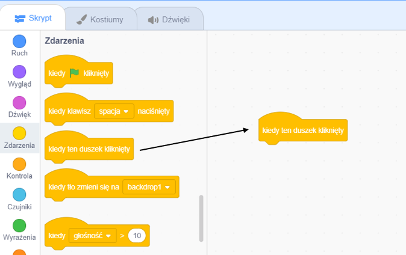
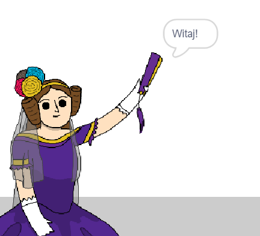

## Ada Lovelace

W 1842 r. Ada Lovelace pisała o używaniu maszyny o nazwie „Silnik analityczny” do wykonywania obliczeń i jest postrzegana jako pierwsza na świecie programistka komputerowa! Ada jako pierwsza zauważyła, że komputery mogą być czymś więcej niż tylko dużymi kalkulatorami.

\--- task \---

Otwórz projekt startowy Scratch „Poetry Generator”.

**Online**: otwórz [projekt początkowy](http://rpf.io/poetry-on){: target = "_ blank"}.

Jeśli masz konto Scratch, możesz wykonać kopię klikając **Remiks**.

**Offline**: otwórz projekt początkowy [ ](http://rpf.io/p/en/beat-the-goalie-go) {:target="_ blank"} w edytorze offline.

Jeśli musisz pobrać i zainstalować edytor Scratcha, znajdziesz go na stronie [rpf.io/scratchoff](http://rpf.io/scratchoff){:target="_blank"}.

\--- /task \---

\--- task \---

Kliknij duszka „Ada” i kliknij kartę `Zdarzenia`{: class = "block3events"} w sekcji kodowania „Skrypty”. Przeciągnij `kiedy ten duszek kliknięty`{: class = "block3events"} blok w obszarze kodowania po prawej stronie.




Każdy kod dodany pod tym blokiem zostanie uruchomiony po kliknięciu Ady!

\--- /task \---

\--- task \---

Kliknij kartę `Kostiumy`{: class = "block3looks"} i przeciągnij `powiedz`{: class = "block3looks"} `Witaj!` `przez 2 sekundy`{: class = "block3looks"} blok pod `kiedy ten duszek kliknięty`{: class = "block3events"} blok, który już dodałaś.


```blocks3
when this sprite clicked
say [Hello!] for (2) seconds
```

\--- /task \---

\--- task \---

Kliknij na Adę, a powinieneś zobaczyć, jak z tobą rozmawia.



\--- /task \---