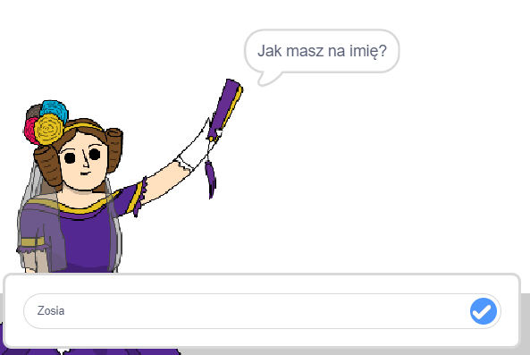
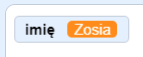
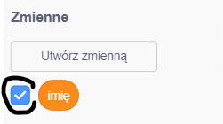
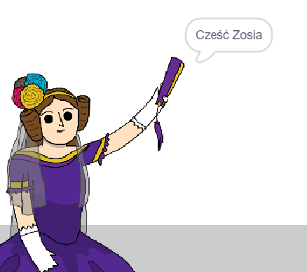

## Powiedz Adzie swoje imię

Ada przedstawiła się, ale nie zna twojego imienia!

\--- task \---

Przeciągnij blok `zapytaj`{: class = "block3sensing"} (z sekcji `Czujniki`{: class = "block3sensing}}) na swój kod. Tak powinien wyglądać twój kod:


```blocks3
when this sprite clicked
say [Hi, I'm Ada!] for (2) seconds
+ ask [What's your name?] and wait
```

\--- /task \---

\--- task \---

Kliknij Adę, aby przetestować kod. Ada powinna zapytać cię o imię, które możesz wpisać!



\--- /task \---

\--- task \---

Możemy użyć **zmiennej ** do przechowywania twojego imienia. Kliknij `Zmienne`{: class = "block3variables"}, a następnie „Utwórz zmienną”. Ponieważ ta zmienna będzie używana do przechowywania twojego imienia, wywołajmy zmienną ... `imię`{: class = "block3variables"}!

[[[generic-scratch3-add-variable]]]

\--- /task \---

\--- task \---

Aby zapisać swoje imię, kliknij kartę `Zmienne`{: class = "block3variables"}, a następnie przeciągnij blok `ustaw imię`{: class = "block3variables"} na koniec kodu.


```blocks3
when this sprite clicked
say [Hi, I'm Ada!] for (2) seconds
ask [What's your name?] and wait
+ set [name v] to [0]
```

\--- /task \---

\--- task \---

Użyj bloku `odpowiedź`{: class = "block3sensing"}, aby zapisać wpisaną odpowiedź.


```blocks3
when this sprite clicked
say [Hi, I'm Ada!] for (2) seconds
ask [What's your name?] and wait
set [name v] to (answer :: +)
```

\--- /task \---

\--- task \---

Kliknij na Ada, aby przetestować kod i wpisz swoje imię, gdy zostaniesz o to poproszony. Powinieneś zobaczyć, że twoje imię zostało zapisane w zmiennej `imię`{: class = "block3variables"}.



\--- /task \---

\--- task \---

Możesz teraz użyć swojego nazwiska w kodzie. Dodaj ten kod:


```blocks3
when this sprite clicked
say [Hi, I'm Ada!] for (2) seconds
ask [What's your name?] and wait
set [name v] to (answer)
+say (join [Hi ] (name)) for (2) seconds 
```

Aby utworzyć ten kod:

1. Przeciągnij blok `połącz`{: class = "blockoperators"} na blok `powiedz`{: class = "blocklooks"}
    
    ```blocks3
    say (join [apple] [banana] :: +) for (2) seconds
    ```

2. Dodaj twój blok `imię`{class = "blockdata"} do bloku `połącz`{class = "blockoperators"}.
    
    ```blocks3
    say (join [Hi] (name :: variables +)) for (2) seconds
    ```

\--- /task \---

\--- task \---

Aby ukryć zmienną `name`{: class = "block3variables"} na scenie, kliknij znacznik obok zmiennej.



\--- /task \---

\--- task \---

Przetestuj swój nowy kod. Ada powinna się z tobą przywitać, używając twojego imienia!



Jeśli między słowem „Cześć” a twoim imieniem nie ma spacji, musisz samodzielnie dodać spację do kodu!

\--- /task \---

\--- zadanie\---

Na koniec dodaj ten kod, aby wyjaśnić, co robić dalej:


```blocks3
when this sprite clicked
say [Hi, I'm Ada!] for (2) seconds
ask [What's your name?] and wait
set [name v] to (answer)
say (join [Hi ] (name)) for (2) seconds 
+ say [Click the computer to generate a poem.] for (2) seconds 
```

\--- /task \---

\--- task \---

Przetestuj kod Ady po raz ostatni, aby upewnić się, że wszystko działa.

\--- /task \---