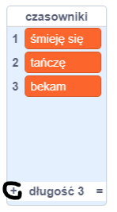
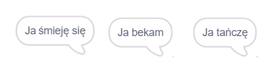

## Silnik analityczny

Zaprogramujmy komputer Ady (zwany „Silnikiem Analitycznym”) do generowania poezji.

\--- task \---

Dodaj ten kod do duszka "Komputer, aby mówił po kliknięciu:


```blocks3
when this sprite clicked
say [Here is your poem...] for (2) seconds
```

\--- /task \---

\--- task \---

Aby utworzyć losowy wiersz, najpierw potrzebujesz **listy** słów. Aby utworzyć nową listę, kliknij kartę `Zmienne`{:class="block3variables"}.

Użyjmy **czasowników** (słów czynności) w pierwszej linii Twojego wiersza. Utwórz nową listę o nazwie `czasowniki`{:class="block3variables"}.

[[[generic-scratch3-make-list]]]

\--- /task \---

\--- task \---

Twoja nowa lista będzie pusta. Kliknij `+` na dole pustej listy i dodaj te czasowniki:



\--- /task \---

\--- task \---

Pierwszym wersem wiersza powinno być słowo „Ja”, a po nim losowy czasownik.

Aby stworzyć tę linijkę poezji, musisz:

1. `Losuj liczbę od`{:class="block3operators"} pomiędzy `1` a `długością listy czasowników`{:class="block3variables"}:
    
    ```blocks3
    (pick random (1) to (length of [verbs v]))
    ```

2. Użyj tego bloku, aby otrzymać losowy `element`{:class="block3variables"} z listy `czasowniki`{:class="block3variables"}:
    
    ```blocks3
    (item (pick random (1) to (length of [verbs v]) :: +) of [verbs v])
    ```

3. `Połącz`{:class="block3operators"} "Ja " z losowym czasownikiem, aby utworzyć pierwszą linijkę Twojego wiersza:
    
    ```blocks3
    (join [I ] (item (pick random (1) to (length of [verbs v])) of [verbs v] :: +))
    ```

4. Użyj bloku `powiedz`{:class="block3looks"}, aby wyświetlić linijkę poezji:
    
    ```blocks3
    say (join [I ](item (pick random (1) to (length of [verbs v])) of [verbs v]) :: +) for (2) seconds
    ```

Twój kod powinien wyglądać tak:


```blocks3
when this sprite clicked
say [Here is your poem...] for (2) seconds
+ say (join [I ](item (pick random (1) to (length of [verbs v])) of [verbs v])) for (2) seconds
```

\--- /task \---

\--- task \---

Teraz przetestuj swój kod kilka razy. Twój komputer powinien za każdym razem wybrać losowe słowo z listy `czasowniki`{:class="block3variables"}.



\--- /task \---