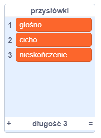
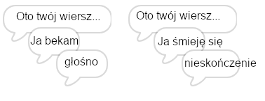
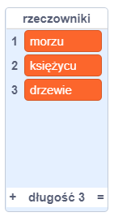
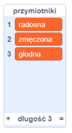
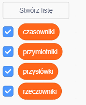

## Więcej poezji

Twój wiersz jest dość krótki - dodajmy coś do niego!

\--- task \---

Użyjmy przysłówków w następnej linijce twojego wiersza. **Przysłówek** to słowo, które opisuje czasownik. Utwórz kolejną listę o nazwie przysłówki i dodaj te 3 słowa:



\--- /task \---

\--- task \---

Dodaj ten wiersz do kodu komputera, aby powiedzieć losowy przysłówek w następnym wersie wiersza:


```blocks3
when this sprite clicked
say [Here is your poem...] for (2) seconds
say (join [I ](item (pick random (1) to (length of [verbs v])) of [verbs v])) for (2) seconds
+say (item (pick random (1) to (length of [adverbs v])) of [adverbs v]) for (2) seconds
```

\--- /task \---

\--- task \---

Teraz przetestuj swój kod kilka razy. Za każdym razem powinieneś zobaczyć losowy wiersz.



\--- /task \---

\--- task \---

Dodaj listę rzeczowników do swojego projektu. **Rzeczownik** to miejsce lub rzecz.



\--- /task \---

\--- task \---

Dodaj kod, aby użyć rzeczowników w wierszu.


```blocks3
when this sprite clicked
say [Here is your poem...] for (2) seconds
say (join [I ](item (pick random (1) to (length of [verbs v])) of [verbs v])) for (2) seconds
say (item (pick random (1) to (length of [adverbs v])) of [adverbs v]) for (2) seconds
+say (join [by the ](item (pick random (1) to (length of [nouns v])) of [nouns v])) for (2) seconds
```

\--- /task \---

\--- task \---

Dodaj listę przymiotników do swojego projektu. **Przymiotnik** jest słowem opisującym.



\--- /task \---

\--- task \---

Dodaj kod, aby użyć przymiotników w swoim wierszu:


```blocks3
when this sprite clicked
say [Here is your poem...] for (2) seconds
say (join [I ](item (pick random (1) to (length of [verbs v])) of [verbs v])) for (2) seconds
say (item (pick random (1) to (length of [adverbs v])) of [adverbs v]) for (2) seconds
say (join [by the ](item (pick random (1) to (length of [nouns v])) of [nouns v])) for (2) seconds
+ say (join [I feel ](item (pick random (1) to (length of [adjectives v])) of [adjectives v])) for (2) seconds
```

\--- /task \---

\--- task \---

Możesz kliknąć pola obok listy, aby je ukryć.



\--- /task \---

\--- task \---

Przetestuj swój nowy wiersz.

\--- /task \---