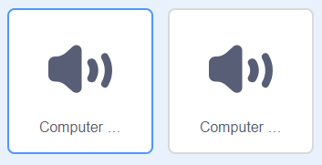

## Animowanie silnika analitycznego

Zaanimujmy twój komputer, tak aby wyglądał jakby generował poezję.

\--- task \---

Kliknij duszek komputera i dodaj ten kod po pierwszym bloku `powiedz`{:class="block3looks"}:

Bloki `powtarzaj`{:class="block3control"} i `czekaj`{:class="block3control"} znajdują się w sekcji `Kontrola`{:class="block3control"}.


```blocks3
when this sprite clicked
say [Here is your poem...] for (2) seconds
+ repeat (10)
    turn left (5) degrees
    wait (0.1) seconds
    turn right (5) degrees
    wait (0.1) seconds  
end
say (join [I ](item (pick random (1) to (length of [verbs v])) of [verbs v])) for (2) seconds
say (item (pick random (1) to (length of [adverbs v])) of [adverbs v]) for (2) seconds
say (join [by the ](item (pick random (1) to (length of [nouns v])) of [nouns v])) for (2) seconds
say (join [I feel ](item (pick random (1) to (length of [adjectives v])) of [adjectives v])) for (2) seconds
```

\--- /task \---

\--- task \---

Przetestuj swój projekt. Powinieneś zobaczyć, jak komputer się trzęsie przed wygenerowaniem wiersza!


\--- /task \---

\--- task \---

Kliknij zakładkę 'Dźwięki' i kliknij ikonę 'Wybierz Dźwięk' w lewym dolnym rogu.

[[[generic-scratch3-sound-from-library]]]

\--- /task \---

\--- task \---

Wybierz dźwięk 'computer beeps' i kliknij OK.



\--- /task \---

\--- task \---

Dodaj blok `zagraj dźwięk`{:class="block3sound"}, aby odtworzyć dźwięk tuż przed rozpoczęciem animacji.


```blocks3
when this sprite clicked
say [Here is your poem...] for (2) seconds
+ start sound (computer beeps1 v)
repeat (10)
    turn left (5) degrees
    wait (0.1) seconds
    turn right (5) degrees
    wait (0.1) seconds  
end
say (join [I ](item (pick random (1) to (length of [verbs v])) of [verbs v])) for (2) seconds
say (item (pick random (1) to (length of [adverbs v])) of [adverbs v]) for (2) seconds
say (join [by the ](item (pick random (1) to (length of [nouns v])) of [nouns v])) for (2) seconds
say (join [I feel ](item (pick random (1) to (length of [adjectives v])) of [adjectives v])) for (2) seconds
```

\--- /task \---