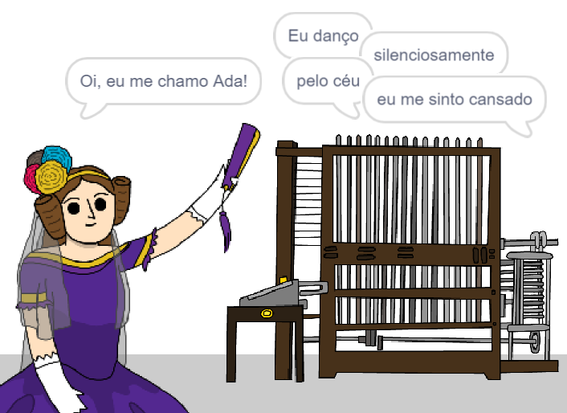

--- no-print ---

Esta é a versão **Scratch 3** do projeto. Há também uma [versão Scratch 2 do projeto](https://projects.raspberrypi.org/pt-BR/projects/poetry-generator-scratch2).

--- /no-print ---

## Introdução

Você vai aprender como programar seu próprio gerador de poesia!

--- no-print ---

  <iframe allowtransparency="true" width="485" height="402" src="https://scratch.mit.edu/projects/embed/382938180/?autostart=false" frameborder="0" scrolling="no"></iframe>
  

--- /no-print ---

--- print-only ---

--- /print-only ---

--- collapse ---
---
title: O que você vai aprender
---

+ Variáveis;
+ Listas e itens de lista aleatórios;
+ Repetição (o bloco `repita`{:class="block3control"}).

--- /collapse ---

--- collapse ---
---
title: O que você vai precisar
---

#### Hardware

+ Um computador capaz de executar o Scratch 3

#### Software

+ Scratch 3 ([online](http://rpf.io/scratchon){:target="_blank"} ou [offline](http://rpf.io/scratchoff){:target="_blank"})

#### Downloads

O projeto inicial pode ser encontrado [aqui](http://rpf.io/p/pt-BR/poetry-generator-go){:target="_blank"}.

--- /collapse ---

--- collapse ---
---
title: Informações adicionais para educadores
---

Este projeto foi criado para comemorar [Ada Lovelace Day](https://findingada.com). Se você é professor, pode baixar um School Resource Pack que também contém um plano de montagem ([downloads.codeclub.org.uk/ada.zip](http://downloads.codeclub.org.uk/ada.zip)), para apresentar às crianças Ada e suas idéias revolucionárias.

--- no-print ---

Se você precisar imprimir este projeto, por favor, use a [versão para impressão](https://projects.raspberrypi.org/pt-BR/projects/poetry-generator/print){:target="_blank"}.

--- /no-print ---

Você pode encontrar o [projeto concluído aqui](http://rpf.io/p/pt-BR/poetry-generator-get){:target="_blank"}.

--- /collapse ---