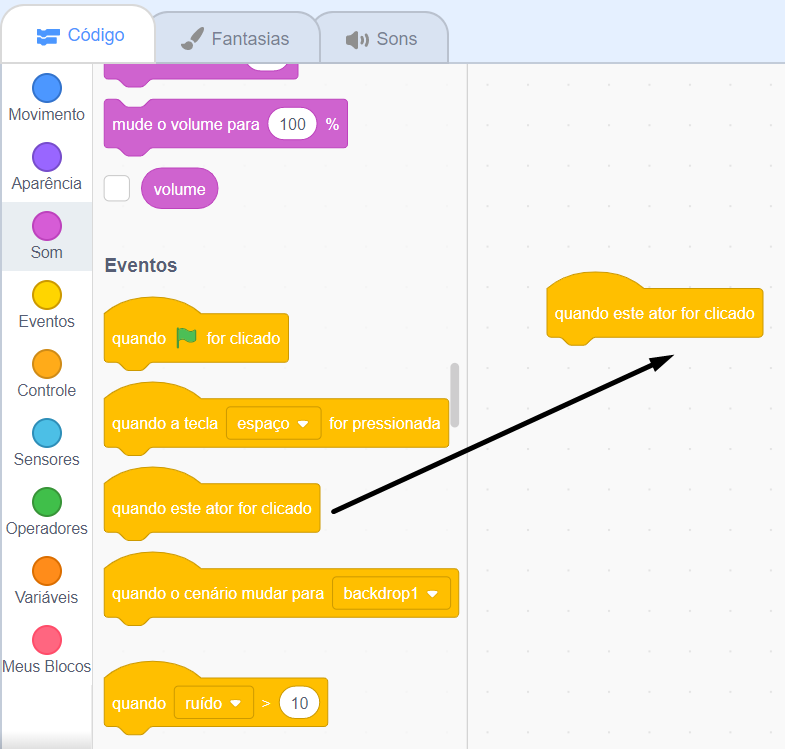
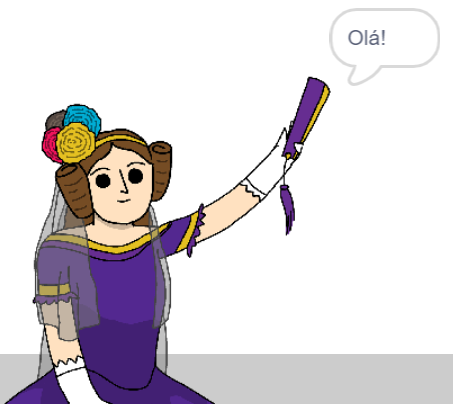

## Ada Lovelace

Em 1842, Ada Lovelace escreveu sobre o uso de uma máquina chamada 'Analytical Engine' para fazer cálculos e é vista como a primeira programadora de computadores do mundo! Ada também foi a primeira a ver que os computadores poderiam ser mais do que grandes calculadoras.

\--- task \---

Abra o projeto inicial do Scratch 'Gerador de poesia'.

**Online**: Abra o projeto [inicial](http://rpf.io/poetry-on){:target="_ blank"}.

Se você tiver uma conta do Scratch, pode fazer uma cópia clicando em **Remix**.

**Off-line**: Abra o [projeto inicial](http://rpf.io/p/en/beat-the-goalie-go){:target="_ blank"} no editor offline.

Se você precisar baixar e instalar o editor offline do Scratch, você pode encontrá-lo em [rpf.io/scratchoff](http://rpf.io/scratchoff){:target="_blank"}.

\--- /task \---

\--- task \---

Clique no ator 'Ada' e clique na guia `Eventos`{:class="block3events"} na seção 'Código'. Arraste o `quando este ator for clicado`{:class="block3events"} para a área de codificação à direita.




Qualquer código adicionado abaixo deste bloco será executado quando a Ada for clicada!

\--- /task \---

\--- task \---

Clique na guia `Aparência`{:class="block3looks"} e arraste o bloco `diga`{:class="block3looks"} `Olá!` `por 2 segundos`{:class="block3looks"} abaixo do `quando este ator for clicado`{:class="block3events"} que você já adicionou.


```blocks3
quando este ator for clicado
diga [Olá!] por (2) segundos
```

\--- /task \---

\--- task \---

Clique em Ada e você a verá falar com você.



\--- /task \---