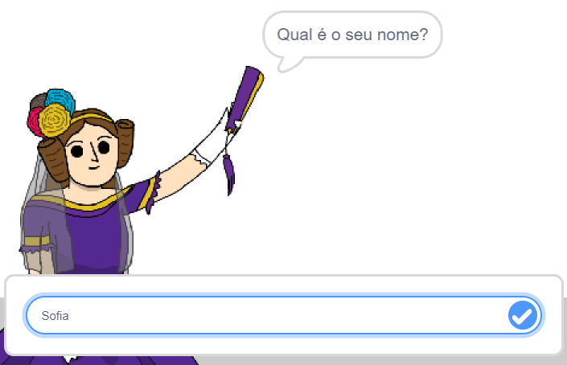
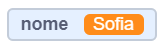
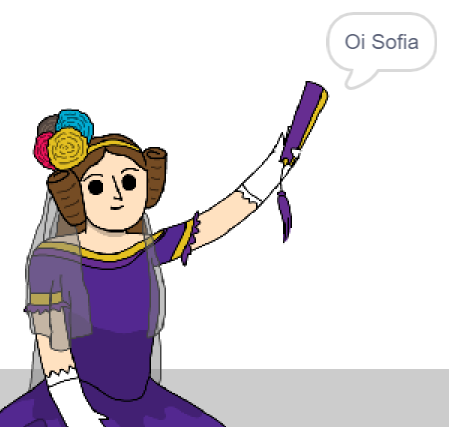

## Dizendo seu nome à Ada

Ada se apresentou, mas ela não sabe o seu nome!

\--- task \---

Arraste um bloco de `pergunte () e espere`{:class="block3sensing"} (da categoria `Sensores`{:class="block3sensing"}) ao seu código. Veja como seu código deve ficar:


```blocks3
quando este ator for clicado
diga [Oi, eu me chamo Ada!] por (2) segundos
+ pergunte [Qual é o seu nome?] e espere
```

\--- /task \---

\--- task \---

Clique na Ada para testar seu código. Ada deve perguntar seu nome, para que possa digitá-lo!



\--- /task \---

\--- task \---

Podemos usar uma **variável** para armazenar o seu nome. Clique em `Variáveis`{: class = "block3variables"} e depois em 'Criar uma Variável'. Como a variável vai servir para armazenar o seu nome, vamos chamá-la de... `nome`{: class = "block3variables"}!

[[[generic-scratch3-add-variable]]]

\--- /task \---

\--- task \---

Para armazenar seu nome, clique na categoria `Variáveis`{:class="block3variables"} e arraste o bloco `mude [] para (resposta)`{: class = "block3variables"}, e coloque-o no final do seu código.


```blocks3
quando este ator for clicado
diga [Oi, eu me chamo Ada!] por (2) segundos
pergunte [Qual é o seu nome?] e espere
+ mude [nome v] para [0]
```

\--- /task \---

\--- task \---

Use o bloco `resposta`{:class="block3sensing"} para armazenar a resposta recebida.


```blocks3
quando este ator for clicado
diga [Oi, eu me chamo Ada!] por (2) segundos
pergunte [Qual é o seu nome?] e espere
mude [nome v] para (resposta)
```

\--- /task \---

\--- task \---

Clique em Ada para testar seu código e digite seu nome quando ela pedir. Você deve observar se seu nome foi armazenado na variável `nome`{:class="block3variables"}.



\--- /task \---

\--- task \---

Agora você pode usar seu nome no seu código. Adicione este código:


```blocks3
quando este ator for clicado
diga [Oi, eu me chamo Ada!] por (2) segundos
pergunte [Qual é o seu nome?] e espere
mude [nome v] para (resposta)
+ diga(junte [Oi] com (nome)) por (2) segundos 
```

Para criar este código:

1. Arraste o bloco `junte (0 com ()`{:class="blockoperators"} para dentro do bloco `diga`{:class="blocklooks"}
    
    ```blocks3
    diga (junte (maçã) com (banana)) por (2) segundos
    ```

2. Coloque o bloco `nome`{:class="blockdata"} dentro do bloco `junte`{:class="blockoperators"}.
    
    ```blocks3
    diga (junte [Oi] com (nome)) por (2) segundos
    ```

\--- /task \---

\--- task \---

Para esconder sua variável `nome`{:class="block3variables"} do palco, clique no símbolo de visto ao lado da variável.


\--- /task \---

\--- task \---

Teste o seu novo código. Ada deverá dizer olá para você, usando seu nome!



Se não tiver espaço entre a palavra 'Olá' e seu nome, você precisará adicionar o espaçamento no seu código!

\--- /task \---

\--- task \---

Finalmente, adicione este código para explicar os próximos passos:


```blocks3
quando este ator for clicado
diga [Oi, eu me chamo Ada!] por (2) segundos
pergunte [Qual é o seu nome?] e espere
mude [nome v] para (resposta)
diga(junte [Oi] com (nome)) por (2) segundos
+ diga [Clique no computador para gerar um poema.] por (2) segundos 
```

\--- /task \---

\--- task \---

Teste o código da Ada pela última vez, para garantir que tudo está funcionando.

\--- /task \---