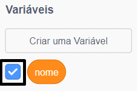

## Dizendo seu nome à Ada

Ada se apresentou, mas ela não sabe o seu nome!

\--- task \---

Arraste um bloco de `pergunte () e espere`{:class="block3sensing"} (da categoria `Sensores`{:class="block3sensing"}) ao seu código. Veja como seu código deve ficar:


```blocks3
quando este ator for clicado
diga [Oi, eu sou a Ada!] por (2) segundos
+ pergunte [Qual é o seu nome?] e espere
```

\--- /task \---

\--- task \---

Clique na Ada para testar seu código. Ada deve perguntar seu nome, para que possa digitá-lo!


\--- /task \---

\--- task \---

Podemos usar uma **variável** para armazenar o seu nome. Clique em `Variáveis`{: class = "block3variables"} e depois em 'Criar uma Variável'. Como a variável vai servir para armazenar o seu nome, vamos chamá-la de... `Nome`{: class = "block3variables"}!

[[[generic-scratch3-add-variable]]]

\--- /task \---

\--- task \---

Para armazenar seu nome, clique na categoria `Variáveis`{:class="block3variables"} e arraste o bloco `Mude [] para (resposta)`{: class = "block3variables"}, e coloque-o no final do seu código.


```blocks3
when this sprite clicked
say [Hi, I'm Ada!] for (2) seconds
ask [What's your name?] and wait
+ set [name v] to [0]
```

\--- /task \---

\--- task \---

Use the `answer`{:class="block3sensing"} block to store the answer you type in.


```blocks3
when this sprite clicked
say [Hi, I'm Ada!] for (2) seconds
ask [What's your name?] and wait
set [name v] to (answer :: +)
```

\--- /task \---

\--- task \---

Click on Ada to test your code, and enter your name when asked. You should see that your name has been stored in the `name`{:class="block3variables"} variable.


\--- /task \---

\--- task \---

You can now make use of your name in your code. Add this code:


```blocks3
when this sprite clicked
say [Hi, I'm Ada!] for (2) seconds
ask [What's your name?] and wait
set [name v] to (answer)
+say (join [Hi ] (name)) for (2) seconds 
```

To create this code:

1. Drag a `join`{:class="blockoperators"} block onto the `say`{:class="blocklooks"} block
    
    ```blocks3
    say (join [apple] [banana] :: +) for (2) seconds
    ```

2. Add your `name`{:class="blockdata"} block onto the `join`{:class="blockoperators"} block.
    
    ```blocks3
    say (join [Hi] (name :: variables +)) for (2) seconds
    ```

\--- /task \---

\--- task \---

To hide your `name`{:class="block3variables"} variable on the stage, click the tick next to the variable.



\--- /task \---

\--- task \---

Test your new code. Ada should say hello to you, using your name!


If there's no space between the word 'Hi' and your name, you'll need to add a space into the code yourself!

\--- /task \---

\--- task \---

Finally, add this code to explain what to do next:


```blocks3
when this sprite clicked
say [Hi, I'm Ada!] for (2) seconds
ask [What's your name?] and wait
set [name v] to (answer)
say (join [Hi ] (name)) for (2) seconds 
+ say [Click the computer to generate a poem.] for (2) seconds 
```

\--- /task \---

\--- task \---

Test Ada's code one last time, to make sure that everything works.

\--- /task \---