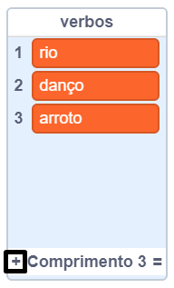
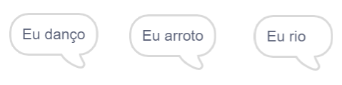

## O Motor Analítico

Vamos programar o computador da Ada (chamado 'Motor Analítico') para gerar a poesia.

\--- task \---

Adicione este código ao seu ator 'Computador', para que fale quando for clicado:


```blocks3
quando este ator for clicado
diga [Aqui está o seu poema] por (2) segundos
```

\--- /task \---

\--- task \---

Para criar um poema aleatório, primeiro precisará criar uma **lista** de palavras que serão usadas. Para criar uma lista, clica na categoria `Variáveis`{:class="block3variables"}.

Vamos usar **verbos** (palavras que indicam ações) na primeira linha do seu poema. Crie uma lista chamada `verbos`{:class="block3variables"}.

[[[generic-scratch3-make-list]]]

\--- /task \---

\--- task \---

Sua nova lista estará vazia. Clique em `+` no final da sua lista vazia e adicione estes verbos:



\--- /task \---

\--- task \---

A primeira linha do seu poema deve começar com a palavra "Eu", seguida de um verbo aleatório.

Para criar esta linha de poesia, você precisa:

1. Escolher `um número aleatório`{:class="block3operators"} entre `1` e o `tamanho de verbos`{:class="block3variables"}:
    
    ```blocks3
    (número aleatório entre (1) e (tamanho de [verbos v]))
    ```

2. Use este bloco para obter um `item` aleatório{:class="block3variables"} a partir da lista de `verbos`{:class="block3variables"}:
    
    ```blocks3
    (item (número aleatório entre (1) e (tamanho de [verbos v])) de [verbos v])
    ```

3. `junte`{:class="block3operators"} a palavra "Eu" com um verbo aleatório, para criar a primeira linha do seu poema:
    
    ```blocks3
    (junte [Eu] com (item (número aleatório entre (1) e (tamanho de [verbos v])) de [verbos v]))
    ```

4. Use o bloco `diga`{:class="block3looks"} para mostrar a linha de poesia:
    
    ```blocks3
    diga (junte [Eu] com (item (número aleatório entre (1) e (tamanho de [verbos v])) de [verbos v])) por (2) segundos
    ```

Seu código deve ficar assim:


```blocks3
quando este ator for clicado
diga [Aqui está o seu poema...] por (2) segundos
+ diga (junte [Eu] com (item (número aleatório entre (1) e (tamanho de [verbos v])) de [verbos v])) por (2) segundos
```

\--- /task \---

\--- task \---

Teste seu código algumas vezes. A cada vez seu computador deverá escolher uma palavra aleatória da lista de `verbos` {:class="block3variables"}.



\--- /task \---