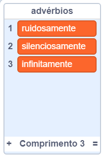
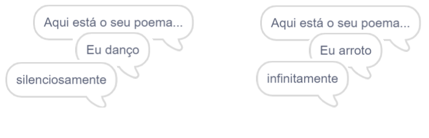
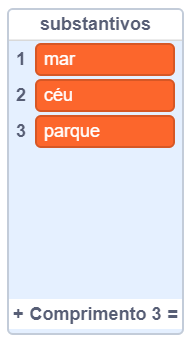
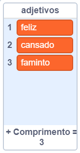
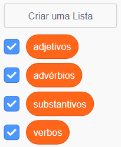

## Mais poesia

Seu poema está muito curto - vamos aumentá-lo!

\--- task \---

Vamos usar advérbios na próxima linha do seu poema. Um **advérbio** é uma palavra que descreve um verbo. Crie outra lista chamada advérbios e adicione estas 3 palavras:



\--- /task \---

\--- task \---

Adicione esta linha ao código do seu computador, para dizer um advérbio aleatório na próxima linha do seu poema:


```blocks3
quando este ator for clicado
diga [Aqui está o seu poema...] por (2) segundos
diga ((junte [Eu] com (item (random) de (verbos)))) por (2) segundos
+ diga ((item (random) de (advérbios))) por (2) segundos
```

\--- /task \---

\--- task \---

Teste seu código algumas vezes. Você deve ver um poema aleatório a cada vez.



\--- /task \---

\--- task \---

Adicione uma lista de substantivos ao seu projeto. Um **substantivo** é um lugar ou uma coisa.



\--- /task \---

\--- task \---

Adicione o código para usar os substantivos no seu poema.


```blocks3
quando este ator for clicado
diga [Aqui está o seu poema...] por (2) segundos
diga ((junte [Eu] com (item (random) de (verbos)))) por (2) segundos
diga ((item (random) de (advérbios))) por (2) segundos
+ diga ((junte [pelo] com (item (random) de (substantivo)))) por (2) segundos
```

\--- /task \---

\--- task \---

Adicione uma lista de adjetivos ao seu projeto. Um **adjetivo** indica um atributo a um substantivo.



\--- /task \---

\--- task \---

Adicione código para usar os adjetivos em seu poema:


```blocks3
quando este ator for clicado
diga [Aqui está o seu poema...] por (2) segundos
diga ((junte [Eu] com (item (random) de (verbos)))) por (2) segundos
diga ((item (random) de (advérbios))) por (2) segundos
diga ((junte [pelo] com (item (random) de (substantivo)))) por (2) segundos
+ diga ((junte [eu sinto] com (item (random) de (adjetivo)))) por (2) segundos
```

\--- /task \---

\--- task \---

Para ocultar suas listas você pode clicar nas caixas de seleção ao lado delas.



\--- /task \---

\--- task \---

Teste seu novo poema.

\--- /task \---