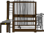

## Animando o Motor Analítico

Vamos animar seu computador, para que pareça estar gerando uma poesia.

--- task ---

Clique em seu ator computador, e adicione este código logo após do primeiro bloco `diga`{:class="block3looks"}:

Você irá encontrar os blocos `repita`{:class="block3control"} e `espere`{:class="block3control"} na categoria `Controle`{:class="block3control"}.



```blocks3
quando este ator for clicado
diga [Aqui está o seu poema...] por (2) segundos
+ repita (10) vezes
    gire < (5) graus
    espere (0.1) seg
    gire > (5) graus
    espere(0.1) seg  
fim
diga (junte [Eu] com (item (número aleatório entre (1) e (tamanho de [verbos v])) de [verbos v])) por (2) segundos
diga (item (random) de [advérbios v]) por (2) segundos
diga (junte [pelo] com (item (número aleatório entre (1) e (tamanho de [substantivos v])) de [substantivos v])) por (2) segundos
diga (junte [Eu me sinto] com (item (número aleatório entre (1) e (tamanho de [adjetivos v])) de [adjetivos v])) por (2) segundos
```

--- /task ---

--- task ---

Teste seu projeto. Você vai ver o computador tremendo antes de produzir um poema!


--- /task ---

--- task ---

Clique na categoria 'Sons', e clique no ícone 'Selecionar um som' no canto inferior esquerdo.

[[[generic-scratch3-sound-from-library]]]

--- /task ---

--- task ---

Escolha o som 'sons de computador' e clique em OK.


--- /task ---

--- task ---

Adicione o bloco `toque o som`{:class="block3sound"}, para que o som seja reproduzido imediatamente antes do início da animação.


```blocks3
quando este ator for clicado
diga [Aqui está o seu poema...] por (2) segundos
+ toque o som (sons de computador1 v)
repita (10) vezes
    gire < (5) graus
    espere (0.1) seg
    gire > (5) graus
    espere(0.1) seg  
fim
diga (junte [Eu] com (item (número aleatório entre (1) e (tamanho de [verbos v])) de [verbos v])) por (2) segundos
diga (item (random) de [advérbios v]) por (2) segundos
diga (junte [pelo] com (item (número aleatório entre (1) e (tamanho de [substantivos v])) de [substantivos v])) por (2) segundos
diga (junte [Eu me sinto] com (item (número aleatório entre (1) e (tamanho de [adjetivos v])) de [adjetivos v])) por (2) segundos
```

--- /task ---