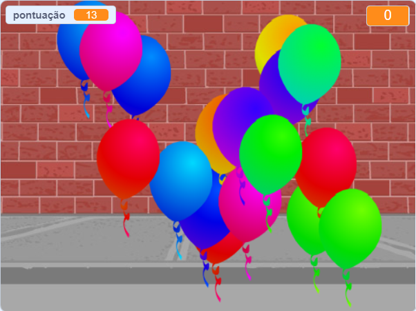

## O que se segue?

Dá uma espreitadela no projeto Scratch [Balões](https://projects.raspberrypi.org/en/projects/balloons).

--- no-print ---

Estoura os balões ao clicar neles.

  <iframe allowtransparency="true" width="485" height="402" src="https://scratch.mit.edu/projects/embed/299206746/?autostart=false" frameborder="0" scrolling="no"></iframe>
  

--- /no-print ---

--- print-only ---

--- /print-only ---

***

Este projeto foi traduzido por voluntários:

Homero Cardoso
Paulo Carvalho

Graças a voluntários, podemos dar às pessoas de todo o mundo a possibilidade de aprender no seu próprio idioma. Tu podes ajudar-nos a alcançar mais pessoas oferecendo-te para traduzir - mais informações em [rpf.io/translate](https://rpf.io/translate).