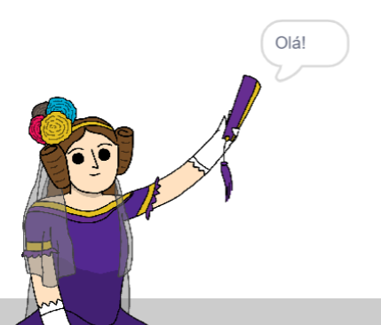

## Ada Lovelace

Em 1842, Ada Lovelace escreveu sobre da utilização de uma máquina chamada 'Motor Analítico' para fazer cálculos e é considerada como a primeira pessoa a programar computadores no mundo! Ada foi também a primeira a perceber que os computadores poderiam ser mais do que grandes calculadoras.

\--- task \---

Abre o projeto inicial do Scratch 'Gerador de Poesia'.

**Online**: abre o projeto [inicial](https://scratch.mit.edu/projects/382665491){:target="_ blank"}.

Se tiveres uma conta Scratch podes fazer uma cópia ao clicar em **Remisturar**.

**Offline**: Abre o [projecto inicial](https://rpf.io/p/pt-PT/poetry-generator-go){:target="_blank"} no editor offline.

Se for necessário descarregar e instalar o editor offline do Scratch, podes encontrá-lo em [rpf.io/scratchoff](https://rpf.io/scratchoff){:target="_blank"}.

\--- /task \---

\--- task \---

Clica no ator 'Ada' e a seguir na categoria `Eventos`{:class="block3events"} do separador 'Código'. Arrasta o bloco `Quando alguém clicar em ti`{:class="block3events"} para a área de construção do código à direita.


Qualquer código adicionado por baixo deste bloco será executado quando a Ada for clicada!

\--- /task \---

\--- task \---

Seleciona a categoria `Aparência`{:class="block3looks"} e arrasta o bloco `diz`{:class="block3looks"} `Olá!` `por 2 segundos`{:class="block3looks"} para debaixo do bloco `Quando alguém clicar em ti`{:class="block3events"} que já adicionaste previamente.


```blocks3
when this sprite clicked
say [Hello!] for (2) seconds
```

\--- /task \---

\--- task \---

Clica na Ada e vais vê-la a falar contigo.



\--- /task \---