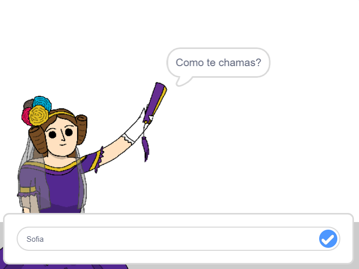

## Dizer à Ada o teu nome

A Ada apresentou-se, mas ela não sabe o teu nome!

--- task ---

Arrasta um bloco `pergunta`{:class="block3sensing"} (da categoria `Sensores`{:class="block3sensing"}) e acrescenta-o ao teu código. Este é o aspeto com que o teu código deve ficar:


```blocks3
when this sprite clicked
say [Olá, eu sou a Ada!] for (2) seconds
+ ask [Como te chamas?] and wait
```

--- /task ---

--- task ---

Clica na Ada para testar o teu código. A Ada deverá perguntar o teu nome, que poderás então digitar!



--- /task ---

--- task ---

Podemos usar uma **variável** para armazenar o teu nome. Clica em `Dados`{:class="block3variables"} e depois em 'Criar uma Variável'. Como a variável vai servir para armazenar o teu nome, vamos chamar à variável... `nome`{:class="block3variables"}!

[[[generic-scratch3-add-variable]]]

--- /task ---

--- task ---

Para armazenar o teu nome, clica na secção `Dados`{:class="block3variables"} e arrasta o bloco `altera o nome`{:class="block3variables"} e coloca-o no final do teu código.


```blocks3
when this sprite clicked
say [Olá, eu sou a Ada!] for (2) seconds
ask [Como te chamas?] and wait
+ set [nome v] to [0]
```

--- /task ---

--- task ---

Usa o bloco `resposta`{:class="block3sensing"} para armazenar a resposta recebida.


```blocks3
when this sprite clicked
say [Olá, eu sou a Ada!] for (2) seconds
ask [Como te chamas?] and wait
set [nome v] to (answer :: +)
```

--- /task ---

--- task ---

Clique na Ada para testar o teu código e digita o teu nome quando for solicitado. Deves conseguir ver que o teu nome foi armazenado na variável `nome`{:class="block3variables"}.


--- /task ---

--- task ---

Agora podes usar o teu nome no teu código. Acrescenta este código:


```blocks3
when this sprite clicked
say [Olá, eu sou a Ada!] for (2) seconds
ask [Como te chamas?] and wait
set [nome v] to (answer)
+say (join [Olá ] (nome)) for (2) seconds 
```

Para criar este código:

1. Arrasta um bloco `a junção de ... com`{:class="blockoperators"} para dentro do bloco `diz`{:class="blocklooks"}
    
    ```blocks3
    say (join [apple] [banana] :: +) for (2) seconds
    ```

2. Adiciona o teu bloco `nome`{:class="blockdata"} ao bloco `junção de ... com`{:class="blockoperators"}.
    
    ```blocks3
    say (join [Olá] (nome :: variables +)) for (2) seconds
    ```

--- /task ---

--- task ---

Para ocultar a tua variável `nome`{:class="block3variables"} do palco, clica na cruz ao lado da variável.


--- /task ---

--- task ---

Testa o teu novo código. A Ada deverá dizer-te olá, usando o teu nome!


Se não houver um espaço entre a palavra 'Olá' e o teu nome, terás tu que o adicionar no teu código!

--- /task ---

--- task ---

Finalmente, adiciona este código para explicar os passos seguintes:


```blocks3
when this sprite clicked
say [Olá, eu sou a Ada!] for (2) seconds
ask [Como te chamas?] and wait
set [nome v] to (answer)
say (join [Olá ] (nome)) for (2) seconds 
+ say [Clica no computador para gerar um poema.] for (2) seconds 
```

--- /task ---

--- task ---

Testa o código da Ada uma última vez, para garantir que está tudo a funcionar.

--- /task ---