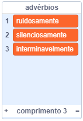
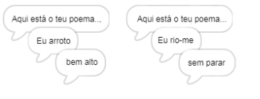
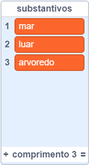
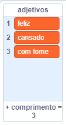
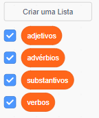

## Mais poesia

O teu poema é bastante curto - vamos aumentá-lo!

\--- task \---

Usemos advérbios na próxima linha do teu poema. Um **advérbio** é uma palavra que descreve um verbo. Cria outra lista chamada advérbios e adiciona-lhe estas 3 palavras:



\--- /task \---

\--- task \---

Adiciona esta linha ao código do ator computador, para dizer um advérbio ao acaso na próxima linha do teu poema:


```blocks3
when this sprite clicked
say [Here is your poem...] for (2) seconds
say (join [I ](item (pick random (1) to (length of [verbs v])) of [verbs v])) for (2) seconds
+say (item (pick random (1) to (length of [adverbs v])) of [adverbs v]) for (2) seconds
```

\--- /task \---

\--- task \---

Testa o teu código algumas vezes. Deverás ver um poema diferente a cada vez.



\--- /task \---

\--- task \---

Adiciona uma lista de substantivos ao teu projeto. Um **substantivo** é um lugar ou uma coisa.



\--- /task \---

\--- task \---

Acrescenta código de forma a usar os substantivos no teu poema.


```blocks3
when this sprite clicked
say [Here is your poem...] for (2) seconds
say (join [I ](item (pick random (1) to (length of [verbs v])) of [verbs v])) for (2) seconds
say (item (pick random (1) to (length of [adverbs v])) of [adverbs v]) for (2) seconds
+say (join [by the ](item (pick random (1) to (length of [nouns v])) of [nouns v])) for (2) seconds
```

\--- /task \---

\--- task \---

Adiciona uma lista de substantivos ao teu projeto. Um **adjetivo** é uma palavra descritiva.



\--- /task \---

\--- task \---

Acrescenta código de forma a usar os adjetivos no teu poema:


```blocks3
when this sprite clicked
say [Here is your poem...] for (2) seconds
say (join [I ](item (pick random (1) to (length of [verbs v])) of [verbs v])) for (2) seconds
say (item (pick random (1) to (length of [adverbs v])) of [adverbs v]) for (2) seconds
say (join [by the ](item (pick random (1) to (length of [nouns v])) of [nouns v])) for (2) seconds
+ say (join [I feel ](item (pick random (1) to (length of [adjectives v])) of [adjectives v])) for (2) seconds
```

\--- /task \---

\--- task \---

Podes clicar nas caixas junto às tuas listas para as ocultar.



\--- /task \---

\--- task \---

Testa o teu novo poema.

\--- /task \---