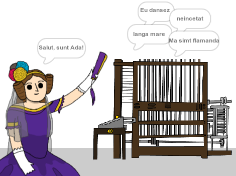

\--- no-print \---

Aceasta este versiunea **Scratch 3** a proiectului. Există, de asemenea, o versiune de [Scratch 2 a proiectului](https://projects.raspberrypi.org/en/projects/poetry-generator-scratch2).

\--- /no-print \---

## Introducere

Vei învăța cum să-ți programezi propriul generator de poezie!

\--- no-print \---

  <iframe allowtransparency="true" width="485" height="402" src="https://scratch.mit.edu/projects/embed/77844926/?autostart=false" frameborder="0" scrolling="no"></iframe>
  

\--- /no-print \---

\--- print-only \---

\--- /print-only \---

## \--- collapse \---

## title: Ce vei învăța

+ Variabile;
+ Liste și elemente aleatoare din liste;
+ Repetare (blocul `repetare`{:class="block3control"}).

\--- /collapse \---

## \--- collapse \---

## title: De ce vei avea nevoie

#### Hardware

+ Un computer capabil să ruleze Scratch 3

#### Software

+ Scratch 3 (fie [online](http://rpf.io/scratchon){:target="_blank"}, fie [offline](http://rpf.io/scratchoff){:target="_blank"})

#### Fișiere descărcabile

Proiectul inițial poate fi găsit [aici](http://rpf.io/p/en/poetry-generator-go){:target="_blank"}.

\--- /collapse \---

## \--- collapse \---

## title: Informații suplimentare pentru educatori

Acest proiect a fost creat pentru a sărbători [Ziua Adei Lovelace](https://findingada.com). If you're a teacher, you can download a School Resource Pack which also contains an assembly plan ([downloads.codeclub.org.uk/ada.zip](http://downloads.codeclub.org.uk/ada.zip)), to introduce children to Ada and her revolutionary ideas.

\--- no-print \---

Dacă ai nevoie să tipărești acest proiect, folosește [versiunea printabilă](https://projects.raspberrypi.org/en/projects/poetry-generator/print){:target="_blank"}.

\--- /no-print \---

Poți găsi [proiectul finalizat aici](http://rpf.io/p/en/poetry-generator-get){:target="_blank"}.

\--- /collapse \---