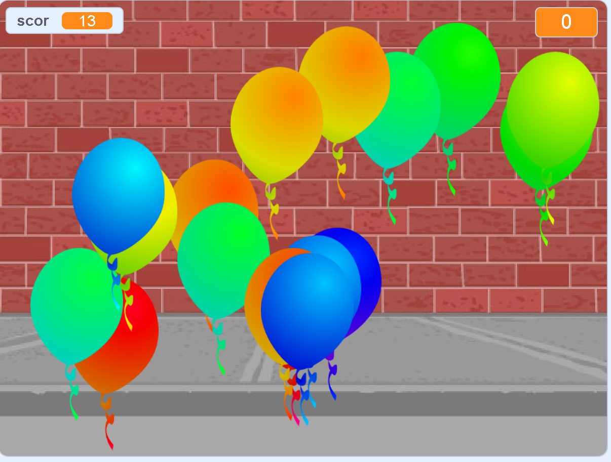

## Ce urmează?

Aruncă o privire la proiectul Scratch [Baloane](https://projects.raspberrypi.org/ro-RO/projects/balloons).

--- no-print ---

Sparge baloanele dând click pe ele.

  <iframe allowtransparency="true" width="485" height="402" src="https://scratch.mit.edu/projects/embed/299206746/?autostart=false" frameborder="0" scrolling="no"></iframe>
  

--- /no-print ---

--- print-only ---

--- /print-only ---

***
Acest proiect a fost tradus de voluntarii:

Manuela Grindei

Gelu Ungur

Datorită voluntarilor, putem oferi oamenilor din întreaga lume șansa de a învăța în propria lor limbă. Ne poți ajuta să ajungem la mai multe persoane, ajutând la traducere ca și voluntar - mai multe informații la [rpf.io/translate](https://rpf.io/translate).