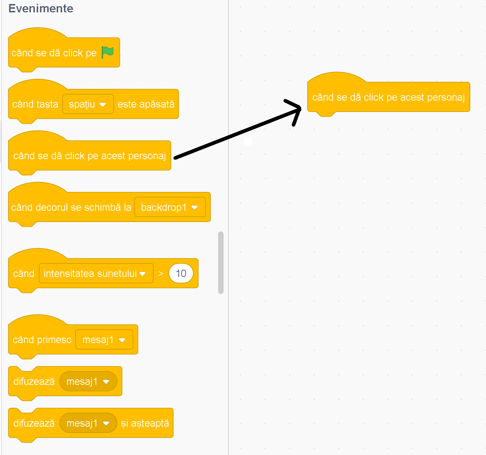
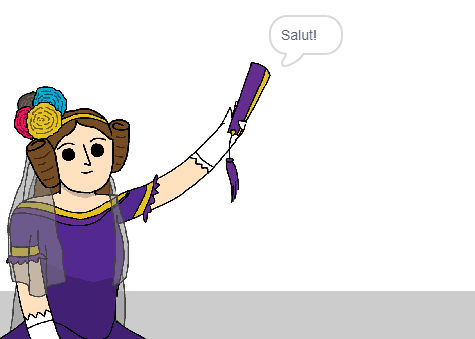

## Ada Lovelace

În 1842, Ada Lovelace a scris despre utilizarea unei mașini numite „motorul analitic” pentru a face calcule și este văzută ca primul programator de calculatoare din lume! Ada a fost și prima care a observat că, de fapt, computerele pot fi mai mult decât niște calculatoare mari.

--- task ---

Deschide proiectul Scratch de început „Generatorul de poezie”.

**Offline**: deschide [proiectul de bază](https://scratch.mit.edu/projects/382738814){:target="_blank"} în editorul offline.

Dacă ai un cont Scratch, poți să creezi o copie dând click pe **Remixează**.

**Offline**: deschide [proiectul de bază](https://rpf.io/p/ro-RO/beat-the-goalie-go){:target="_blank"} în editorul offline.

Dacă trebuie să descarci și să instalezi editorul Scratch offline, îl poți găsi la [rpf.io/scratchoff](https://rpf.io/scratchoff){:target="_blank"}.

--- /task ---

--- task ---

Dă click pe personajul tău „Ada” și dă click pe `Evenimente`{:class="block3events"} din secțiunea de „Scripts”. Trage blocul `când se dă click pe acest personaj`{:class="block3events"} în zona de programare din dreapta.




Orice cod adăugat sub acest bloc se va executa atunci când se dă click pe Ada!

--- /task ---

--- task ---

Dă click pe tab-ul `Aspect`{:class="block3looks"} și glisează blocul `spune`{:class="block3looks"} `Salut!` `pentru 2 puncte `{:class="block3looks"} sub blocul `când se dă click pe acest personaj`{:class="block3events"} pe care l-ai adăugat deja.


```blocks3
when this sprite clicked
say [Salut!] for (2) seconds
```

--- /task ---

--- task ---

Dă click pe Ada și ar trebui să o vezi vorbind cu tine.



--- /task ---
