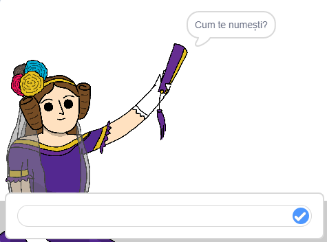
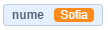
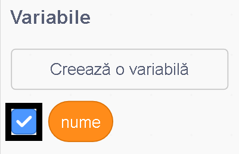
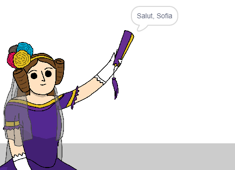

## Spune-i Adei numele tău

Ada s-a prezentat, dar nu știe numele tău!

\--- task \---

Trage un bloc `întreabă`{:class="block3sensing"} (de la secțiunea `detectare`{:class="block3sensing"}) la codul tău. Așa ar trebui să arate codul tău:


```blocks3
when this sprite clicked
say [Hi, I'm Ada!] for (2) seconds
+ ask [What's your name?] and wait
```

\--- /task \---

\--- task \---

Dă click pe Ada pentru a-ți testa codul. Ada ar trebui să-ți solicite numele, pe care îl poți introduce!



\--- /task \---

\--- task \---

Putem folosi o **variabilă** pentru a stoca numele. Click `Variables`{:class="block3variables"}, and then 'Make a Variable'. Deoarece această variabilă va fi folosită pentru a-ți stoca numele, să numim variabila... `nume`{:class="block3variables"}!

[[[generic-scratch3-add-variable]]]

\--- /task \---

\--- task \---

To store your name, click the `Variables`{:class="block3variables"} tab, and then drag the `set name`{:class="block3variables"} block onto the end of your code.


```blocks3
when this sprite clicked
say [Hi, I'm Ada!] for (2) seconds
ask [What's your name?] and wait
+ set [name v] to [0]
```

\--- /task \---

\--- task \---

Folosește blocul `răspuns`{:class="block3sensing"} pentru a stoca răspunsul pe care îl introduci.


```blocks3
when this sprite clicked
say [Hi, I'm Ada!] for (2) seconds
ask [What's your name?] and wait
set [name v] to (answer :: +)
```

\--- /task \---

\--- task \---

Dă click pe Ada pentru a testa codul tău și introdu numele tău atunci când este solicitat. Ar trebui să vezi că numele tău a fost stocat în variabila `nume`{:class="block3variables"}.



\--- /task \---

\--- task \---

Acum poți folosi numele tău în codul tău. Adaugă acest cod:


```blocks3
when this sprite clicked
say [Hi, I'm Ada!] for (2) seconds
ask [What's your name?] and wait
set [name v] to (answer)
+say (join [Hi ] (name)) for (2) seconds 
```

Pentru a crea acest cod:

1. Trage un bloc `alătură`{:class="blockoperators"} pe blocul `spune`{:class="blocklooks"}
    
    ```blocks3
    say (join [apple] [banana] :: +) for (2) seconds
    ```

2. Adaugă blocul `nume`{:class="blockdata"} pe blocul `alătură-te`{:class="blockoperators"}.
    
    ```blocks3
    say (join [Hi] (name :: variables +)) for (2) seconds
    ```

\--- /task \---

\--- task \---

Pentru a ascunde variabila `nume`{:class="block3variables"} de pe scenă, dă click pe bifa de lângă variabilă.



\--- /task \---

\--- task \---

Testează-ți noul cod. Ada ar trebui să te salute, folosindu-ți numele!



Dacă nu există spațiu între cuvântul „Salut” și numele tău, va trebui să adaugi un spațiu în cod!

\--- /task \---

\--- task \---

În cele din urmă, adaugă acest cod pentru a explica ce trebuie să faci în continuare:


```blocks3
when this sprite clicked
say [Hi, I'm Ada!] for (2) seconds
ask [What's your name?] and wait
set [name v] to (answer)
say (join [Hi ] (name)) for (2) seconds 
+ say [Click the computer to generate a poem.] for (2) seconds 
```

\--- /task \---

\--- task \---

Testează codul Adei încă odată, pentru a te asigura că totul funcționează.

\--- /task \---