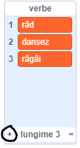
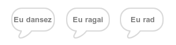

## Motorul analitic

Să programăm computerul Adei (denumit „Motorul Analitic”) să genereze poezie.

--- task ---

Adaugă acest cod la personajul „Computer”, astfel încât acesta să vorbească atunci când dă click pe el:


```blocks3
when this sprite clicked
say [Aici este poezia ta…] for (2) seconds
```

--- /task ---

--- task ---

Pentru a crea o poezie aleatorie, mai întâi ai nevoie de o **listă** de cuvinte pentru a le folosi. Pentru a crea o nouă listă, dă click pe blocul `Variabile` {:class="block3variables"}.

Să folosim **verbe** (cuvinte de acțiune) în prima linie a poeziei tale. Creează o nouă listă numită `verbe`{:class="block3variables"}.

[[[generic-scratch3-make-list]]]

--- /task ---

--- task ---

Noua ta listă va fi goală. Dă click pe `+` din partea de jos a listei tale goale și adaugă aceste versuri:



--- /task ---

--- task ---

Primul vers al poeziei tale ar trebui să fie cuvântul „eu”, urmat de un verb aleatoriu.

Pentru a crea acest vers, trebuie să:

1. `Alegi un număr aleator`{:class="block3operators"} între `1` și `lungimea listei „verbe<”/0>{:class="block3variables"}:

    ```blocks3
    (pick random (1) to (length of [verbe v]))
    ```
    
2. Folosește acest bloc pentru a obține un `element`{:class="block3variables"} aleatoriu din lista `verbe`{:class="block3variables"}:
        
    ```blocks3
    (item (pick random (1) to (length of [verbe v]) :: +) of [verbe v])
    ```
    
3. `Alătură` {:class="block3operators"} „Eu” cu verbul aleator pentru a crea primul vers al poeziei tale:
        
    ```blocks3
    (join [Eu ] (item (pick random (1) to (length of [verbe v])) of [verbe v] :: +))
    ```
    
4. Folosește un bloc `spune`{:class="block3looks"} pentru a afișa primul vers al poeziei:
        
    ```blocks3
    say (join [Eu ](item (pick random (1) to (length of [verbe v])) of [verbe v]) :: +) for (2) seconds
    ```
    
Codul tău ar trebui să arate astfel:
    

    
```blocks3
when this sprite clicked
say [Aici este poezia ta…] for (2) seconds
+ say (join [Eu ](item (pick random (1) to (length of [verbe v])) of [verbe v])) for (2) seconds
```
    
--- /task ---
    
--- task ---
    
Testează-ți codul de câteva ori. Computer-ul tău ar trebui să aleagă un cuvânt aleatoriu din lista `verbe`{:class="block3variables"} de fiecare dată.
    

    
 --- /task ---