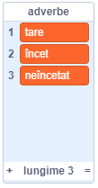
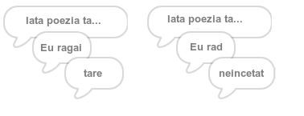
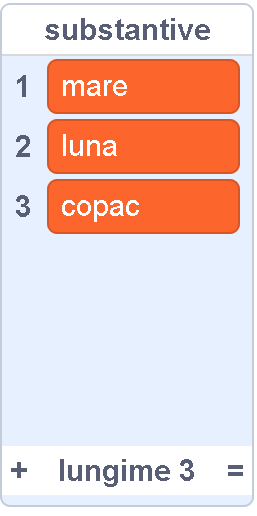
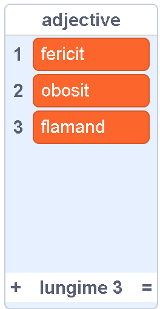
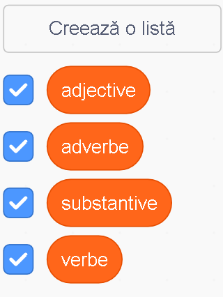

## Mai multă poezie

Poezia ta este destul de scurtă - hai să o mărim!

--- task ---

Să folosim adverbe în următorul vers al poeziei tale. Un **adverb** este un cuvânt care descrie un verb. Creează o altă listă numită adverbe și adaugă aceste 3 cuvinte:



--- /task ---

--- task ---

Adaugă această linie la codul computerului tău pentru ca acesta să pună un adverb aleatoriu pe următorul vers al poeziei:


```blocks3
when this sprite clicked
say [Aici este poezia ta…] for (2) seconds
say (join [Eu ](item (pick random (1) to (length of [verbe v])) of [verbe v])) for (2) seconds
+say (item (pick random (1) to (length of [adverbe v])) of [adverbe v]) for (2) seconds
```

--- /task ---

--- task ---

Testează-ți codul de câteva ori. Ar trebui să vezi o poezie aleatorie de fiecare dată.



--- /task ---

--- task ---

Adaugă o listă de substantive la proiectul tău. Un **substantiv** este un loc sau un lucru.



--- /task ---

--- task ---

Adaugă cod pentru a folosi substantivele în poezia ta.


```blocks3
when this sprite clicked
say [Aici este poezia ta…] for (2) seconds
say (join [Eu ](item (pick random (1) to (length of [verbe v])) of [verbe v])) for (2) seconds
say (item (pick random (1) to (length of [adverbe v])) of [adverbe v]) for (2) seconds
+say (join [lângă ](item (pick random (1) to (length of [substantive v])) of [substantive v])) for (2) seconds
```

--- /task ---

--- task ---

Adaugă o listă de adjective la proiectul tău. Un **adjectiv** este un cuvânt descriptiv.



--- /task ---

--- task ---

Adaugă cod pentru a folosi substantivele în poezia ta:


```blocks3
when this sprite clicked
say [Aici este poezia ta…] for (2) seconds
say (join [Eu ](item (pick random (1) to (length of [verbe v])) of [verbe v])) for (2) seconds
say (item (pick random (1) to (length of [adverbe v])) of [adverbe v]) for (2) seconds
say (join [lângă ](item (pick random (1) to (length of [substantive v])) of [substantive v])) for (2) seconds
+ say (join [Mă simt ](item (pick random (1) to (length of [adjective v])) of [adjective v])) for (2) seconds
```

--- /task ---

--- task ---

Poți da click pe casetele de lângă listele tale pentru a le ascunde.



--- /task ---

--- task ---

Testează-ți noua poezie.

--- /task ---