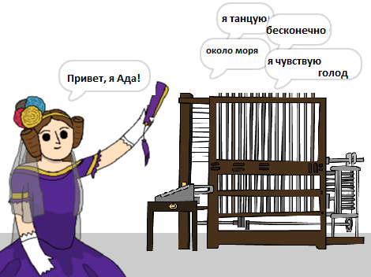

--- no-print ---

Это версия проекта для **Scratch 3**. Есть также [версия проекта для Scratch 2](https://projects.raspberrypi.org/ru-RU/projects/poetry-generator-scratch2).

--- /no-print ---

## Введение

Ты сможешь создать программу для своего собственного генератора стихов!

--- no-print ---

  <iframe allowtransparency="true" width="485" height="402" src="https://scratch.mit.edu/projects/embed/382745672/?autostart=false" frameborder="0" scrolling="no"></iframe>
  

--- /no-print ---

--- print-only ---

--- /print-only ---

--- collapse ---
---
title: Чему ты научишься
---

+ Переменные;
+ Списки и случайные элементы списка;
+ Повторение (блок `повторить`{:class="block3control"}).

--- /collapse ---

--- collapse ---
---
title: Что тебе понадобится
---

#### Оборудование

+ Компьютер, способный запускать Scratch 3

#### Программное обеспечение

+ Scratch 3 (либо [онлайн](http://rpf.io/scratchon){:target="_blank"}, либо [оффлайн (без подключения к Интернету) версия](http://rpf.io/scratchoff){:target="_blank"})

#### Загрузки

Начальный проект можно найти [здесь](http://rpf.io/p/ru-RU/poetry-generator-go){:target="_blank"}.

--- /collapse ---

--- collapse ---
---
title: Дополнительная информация для преподавателей
---

Этот проект посвящен [Дню Ады Лавлейс](https://findingada.com). Если вы учитель, вы можете скачать школьный пакет ресурсов, содержащий также план сборки ([downloads.codeclub.org.uk/ada.zip](http://downloads.codeclub.org.uk/ada.zip)), чтобы познакомить детей с Адой и ее революционными идеями.

--- no-print ---

Если ты хочешь распечатать этот проект, то воспользуйся [версией для печати](https://projects.raspberrypi.org/ru-RU/projects/poetry-generator/print){:target="_blank"}.

--- /no-print ---

Здесь ты можешь найти [завершённый проект](http://rpf.io/p/ru-RU/poetry-generator-get){:target="_blank"}.

--- /collapse ---