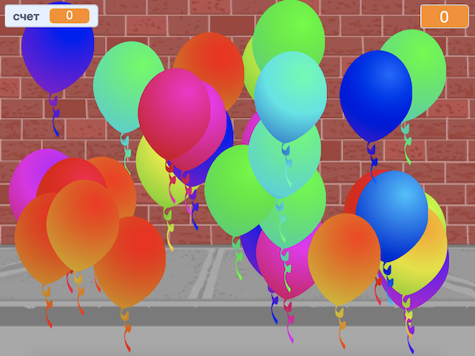

## Что дальше?

Взгляни на проект Scratch [Воздушные шары](https://projects.raspberrypi.org/ru-RU/projects/balloons).

--- no-print ---

Лопай воздушные шары, нажав на них.

  <iframe allowtransparency="true" width="485" height="402" src="https://scratch.mit.edu/projects/embed/299206746/?autostart=false" frameborder="0" scrolling="no"></iframe>
  

--- /no-print ---

--- print-only ---

--- /print-only ---

***
Этот проект был переведен волонтерами:

Сергей Градович

Masha Gaponik

Благодаря волонтерам мы можем дать возможность людям во всем мире учиться на их родном языке. Вы можете помочь нам привлечь больше волонтёров-переводчиков - подробнее на [rpf.io/translate](https://rpf.io/translate).