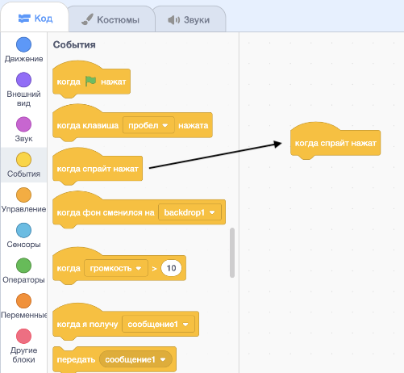
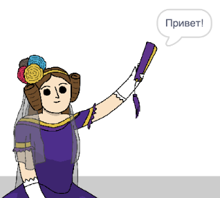

## Ада Лавлейс

В 1842 году Ада Лавлейс написала работу о вычислительной машине под названием «Аналитический двигатель», и считается первым в мире программистом! Ада также была первой, кто поняла, что компьютеры могут быть не просто большими калькуляторами.

\--- task \---

Открой стартовый проект «Генератор поэзии».

**Онлайн**: открыть [стартовый проект](http://rpf.io/poetry-on){:target="_ blank"}.

Если у тебя есть учетная запись в Scratch, то ты можешь сделать копию, нажав **Ремикс**.

**Оффлайн**: открыть [стартовый проект](http://rpf.io/p/ru-RU/beat-the-goalie-go){:target="_blank"} в оффлайн-редакторе.

Если тебе нужно скачать и установить оффлайн редактор Scratch, ты можешь найти его по адресу [rpf.io/scratchoff](http://rpf.io/scratchoff){:target="_blank"}.

\--- /task \---

\--- task \---

Щелкни по спрайту 'Ада' и перейди на вкладку `События`{:class="block3events"} в разделе 'Код'. Перетащите блок `когда спрайт нажат`{:class="block3events"} в область кодирования справа.




Любой код, добавленный под этот блок, будет запускаться при нажатии на Аду!

\--- /task \---

\--- task \---

Перейдите на вкладку `Внешний вид`{:class="block3looks"} и перетащите блок `говорить`{:class="block3looks"} `Привет!` `2 секунд`{:class="block3looks"} под блок `когда спрайт нажат`{:class="block3events"}, который ты уже добавил.


```blocks3
when this sprite clicked
say [Hello!] for (2) seconds
```

\--- /task \---

\--- task \---

Нажми на Аду и она с тобой заговорит.



\--- /task \---