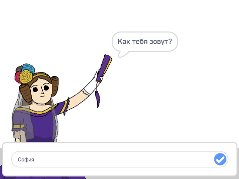
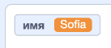
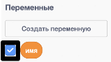
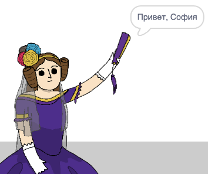

## Говорим Аде свое имя

Ада представилась, но она не знает твоего имени!

\--- task \---

Перетащи блок `спросить`{:class="block3sensing"} (из раздела `сенсоры`{:class="block3sensing"}) в свой код. Вот как должен выглядеть твой код:


```blocks3
when this sprite clicked
say [Hi, I'm Ada!] for (2) seconds
+ ask [What's your name?] and wait
```

\--- /task \---

\--- task \---

Нажми на Аду, чтобы проверить свой код. Ада должна спросить у тебя твое имя, которое ты можешь ввести!



\--- /task \---

\--- task \---

Мы можем использовать **переменную**, чтобы сохранить имя. Нажми `Переменные`{:class="block3variables"}, а затем «Создать переменную». Поскольку эта переменная будет использоваться для хранения твоего имени, давай назовем переменную... `имя`{:class="block3variables"}!

[[[generic-scratch3-add-variable]]]

\--- /task \---

\--- task \---

Чтобы сохранить свое имя, перейди на вкладку `Переменные`{: class="block3variables"} и перетащи блок `задать имя`{:class="block3variables"} в конец кода.


```blocks3
when this sprite clicked
say [Hi, I'm Ada!] for (2) seconds
ask [What's your name?] and wait
+ set [name v] to [0]
```

\--- /task \---

\--- task \---

Используй блок `ответ`{:class="block3sensing"}, чтобы сохранить введенный тобой ответ.


```blocks3
when this sprite clicked
say [Hi, I'm Ada!] for (2) seconds
ask [What's your name?] and wait
set [name v] to (answer :: +)
```

\--- /task \---

\--- task \---

Нажми на Аду, чтобы проверить свой код, и введите свое имя, когда его спросят. Ты увидишь, что твое имя сохранится в переменной `имя`{:class="block3variables"}.



\--- /task \---

\--- task \---

Теперь ты можешь использовать свое имя в коде. Добавь этот код:


```blocks3
when this sprite clicked
say [Hi, I'm Ada!] for (2) seconds
ask [What's your name?] and wait
set [name v] to (answer)
+say (join [Hi ] (name)) for (2) seconds 
```

Чтобы создать этот код:

1. Перетащи блок `объединить`{:class="blockoperators"} в блок `говорить`{:class="blocklooks"}
    
    ```blocks3
    say (join [apple] [banana] :: +) for (2) seconds
    ```

2. Добавь блок `имя`{:class="blockdata"} в блок `объединить`{:class="blockoperators"}.
    
    ```blocks3
    say (join [Hi] (name :: variables +)) for (2) seconds
    ```

\--- /task \---

\--- task \---

Чтобы скрыть переменную `имя`{:class="block3variables"} на сцене, щелкни галочку рядом с переменной.



\--- /task \---

\--- task \---

Проверь свой новый код. Ада должна тебя поприветствовать, используя твое имя!



Если между словом «Привет» и твоим именем нет пробела, тебе нужно добавить пробел в код самостоятельно!

\--- /task \---

\--- task \---

Наконец, добавь этот код, чтобы объяснить, что делать дальше:


```blocks3
when this sprite clicked
say [Hi, I'm Ada!] for (2) seconds
ask [What's your name?] and wait
set [name v] to (answer)
say (join [Hi ] (name)) for (2) seconds 
+ say [Click the computer to generate a poem.] for (2) seconds 
```

\--- /task \---

\--- task \---

Протестируй код Ады в последний раз, чтобы убедиться, что все работает.

\--- /task \---