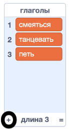
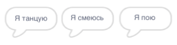

## Аналитический двигатель

Давай запрограммируем компьютер Ады (так называемый «Аналитический двигатель»), чтобы он генерировал поэзию.

--- task ---

Добавь этот код к спрайту «Компьютер», чтобы он говорил при нажатии:


```blocks3
when this sprite clicked
say [Вот твое стихотворение…] for (2) seconds
```

--- /task ---

--- task ---

Чтобы создать случайное стихотворение, сначала тебе понадобится использовать **список** слов. Чтобы создать новый список, нажми на вкладку `Переменные`{:class="block3variables"}.

Давай использовать **глаголы** (слова-действия) в первой строке нашего стихотворения. Создай новый список с именем `глаголы`{:class="block3variables"}.

[[[generic-scratch3-make-list]]]

--- /task ---

--- task ---

Твой новый список будет пустым. Нажми `+` внизу твоего пустого списка и добавь эти глаголы:



--- /task ---

--- task ---

Первая строка твоего стихотворения должна быть словом «Я», за которым следует случайный глагол.

Для создания этой строки стихотворения, необходимо:

1. `Выдать случайное число`{:class="block3operators"} от `1` и до `длины списка глаголов`{:class="block3variables"}:
    
    ```blocks3
    (pick random (1) to (length of [глаголы v]))
    ```

2. Используй этот блок, чтобы получить случайный `элемент`{:class="block3variables"} из списка `глаголов`{:class="block3variables"}:
    
    ```blocks3
    (item (pick random (1) to (length of [глаголы v]) :: +) of [глаголы v])
    ```

3. `Объедини`{:class="block3operators"} "Я" со случайным глаголом, чтобы создать первую строку твоего стихотворения:
    
    ```blocks3
    (join [Я ] (item (pick random (1) to (length of [глаголы v])) of [глаголы v] :: +))
    ```

4. Используйте блок `говорить`{:class="block3looks"} для отображения строки стихотворения:
    
    ```blocks3
    say (join [Я ](item (pick random (1) to (length of [глаголы v])) of [глаголы v]) :: +) for (2) seconds
    ```

Твой код должен выглядеть вот так:


```blocks3
when this sprite clicked
say [Вот твое стихотворение…] for (2) seconds
+ say (join [Я ](item (pick random (1) to (length of [глаголы v])) of [глаголы v])) for (2) seconds
```

--- /task ---

--- task ---

Протестируй свой код несколько раз. Твой компьютер должен каждый раз выбирать случайное слово из списка `глаголов`{:class="block3variables"}.



--- /task ---