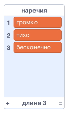
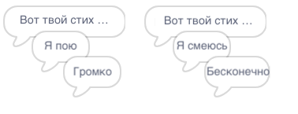
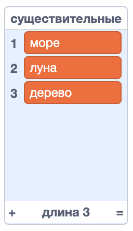
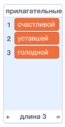
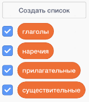

## Больше поэзии

Твое стихотворение довольно короткое - давай дополним его!

\--- task \---

Давай использовать наречия в следующей строке твоего стихотворения. **Наречие** - это слово, которое описывает глагол. Создай еще один список под названием наречия и добавь эти 3 слова:



\--- /task \---

\--- task \---

Добавь эту строку в код твоего компьютера, чтобы сказать случайное наречие в следующей строке твоего стихотворения:


```blocks3
when this sprite clicked
say [Here is your poem...] for (2) seconds
say (join [I ](item (pick random (1) to (length of [verbs v])) of [verbs v])) for (2) seconds
+say (item (pick random (1) to (length of [adverbs v])) of [adverbs v]) for (2) seconds
```

\--- /task \---

\--- task \---

Протестируй свой код несколько раз. Ты должен видеть каждый раз случайное стихотворение.



\--- /task \---

\--- task \---

Добавь список существительных в твой проект. **Существительное** - это место или вещь.



\--- /task \---

\--- task \---

Добавь код, чтобы использовать существительные в твоем стихотворении.


```blocks3
when this sprite clicked
say [Here is your poem...] for (2) seconds
say (join [I ](item (pick random (1) to (length of [verbs v])) of [verbs v])) for (2) seconds
say (item (pick random (1) to (length of [adverbs v])) of [adverbs v]) for (2) seconds
+say (join [by the ](item (pick random (1) to (length of [nouns v])) of [nouns v])) for (2) seconds
```

\--- /task \---

\--- task \---

Добавь список прилагательных в твой проект. **Прилагательное** - это описательное слово.



\--- /task \---

\--- task \---

Добавь код, чтобы использовать прилагательные в твоем стихотворении:


```blocks3
when this sprite clicked
say [Here is your poem...] for (2) seconds
say (join [I ](item (pick random (1) to (length of [verbs v])) of [verbs v])) for (2) seconds
say (item (pick random (1) to (length of [adverbs v])) of [adverbs v]) for (2) seconds
say (join [by the ](item (pick random (1) to (length of [nouns v])) of [nouns v])) for (2) seconds
+ say (join [I feel ](item (pick random (1) to (length of [adjectives v])) of [adjectives v])) for (2) seconds
```

\--- /task \---

\--- task \---

Ты можешь нажать на галочку рядом со списками, чтобы скрыть их.



\--- /task \---

\--- task \---

Проверь свое новое стихотворение.

\--- /task \---