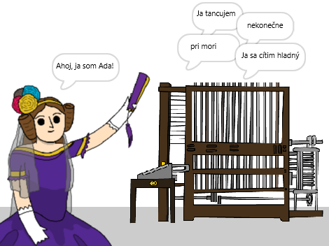

\--- no-print \---

Toto je verzia projektu pre **Scratch 3**. K dispozícii je tiež verzia projektu pre [Scratch 2](https://projects.raspberrypi.org/en/projects/poetry-generator-scratch2).

\--- /no-print \---

## Úvod

Dozvieš sa, ako naprogramovať generátor básní!

\--- no-print \---

  <iframe allowtransparency="true" width="485" height="402" src="https://scratch.mit.edu/projects/embed/77844926/?autostart=false" frameborder="0" scrolling="no"></iframe>
  

\--- /no-print \---

\--- print-only \---

\--- /print-only \---

## \--- collapse \---

## title: Čo sa naučíš

+ Premenné;
+ Zoznamy a náhodné prvky zoznamu;
+ Opakovanie (blok `opakuj`{:class="block3control"}).

\--- /collapse \---

## \--- collapse \---

## title: Čo budeš potrebovať

#### Hardvér

+ Počítač, na ktorom je možné spustiť aplikáciu Scratch 3

#### Softvér

+ Scratch 3 (buď [online](http://rpf.io/scratchon){:target="_blank"} alebo [offline](http://rpf.io/scratchoff){:target="_blank"})

#### Súbory na stiahnutie

Štartovací projekt nájdeš [tu](http://rpf.io/p/en/poetry-generator-go){:target="_blank"}.

\--- /collapse \---

## \--- collapse \---

## title: Doplňujúce informácie pre vyučujúcich

Tento projekt bol vytvorený na oslavu [Ada Lovelace Day](https://findingada.com). If you're a teacher, you can download a School Resource Pack which also contains an assembly plan ([downloads.codeclub.org.uk/ada.zip](http://downloads.codeclub.org.uk/ada.zip)), to introduce children to Ada and her revolutionary ideas.

\--- no-print \---

Ak potrebujete tento projekt vytlačiť, použite [ verziu pre tlač ](https://projects.raspberrypi.org/en/projects/poetry-generator/print){:target="_blank"}.

\--- /no-print \---

Hotový projekt nájdeš [tu](http://rpf.io/p/en/poetry-generator-get){:target="_blank"}.

\--- /collapse \---