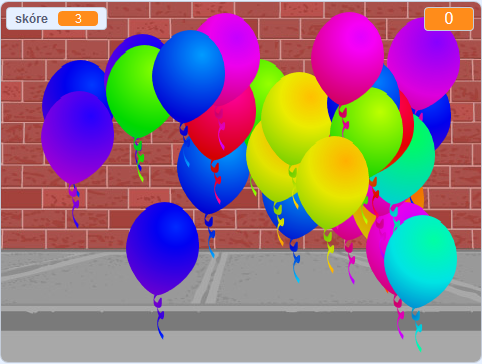

## Čo ďalej?

Pozri sa na ďalší Scratch projekt [Balóny](https://projects.raspberrypi.org/en/projects/balloons).

\--- no-print \---

Praskni balóny tým, že na ne klikneš.

  <iframe allowtransparency="true" width="485" height="402" src="https://scratch.mit.edu/projects/embed/299206746/?autostart=false" frameborder="0" scrolling="no"></iframe>
  

\--- /no-print \---

\--- print-only \---

\--- /print-only \---