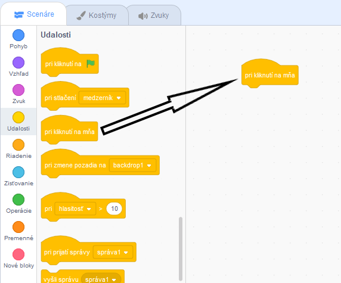
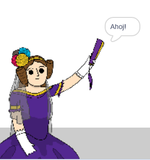

## Ada Lovelace

V roku 1842, Ada Lovelace opísala počítací stroj s názvom 'Analytical Engine' (analytický stroj). Ada je považovaná za prvú počítačovú programátorku na svete! Ada bola tiež prvá, ktorá tvrdila, že počítače môžu byť viac ako len veľké kalkulačky.

\--- task \---

Otvor si štartovací Scratch projekt 'Generátor básní'.

**Online**: open the [starter project](https://rpf.io/poetry-on){:target="_blank"}.

Ak máš účet v Scratch-i, môžeš si vytvoriť kópiu projektu kliknutím na **Remixuj**.

**Offline**: open the [starter project](https://rpf.io/p/en/poetry-generator-go){:target="_blank"} in the offline editor.

If you need to download and install the Scratch offline editor, you can find it at [rpf.io/scratchoff](https://rpf.io/scratchoff){:target="_blank"}.

\--- /task \---

\--- task \---

Kliknite na postavu „Ada“ a potom kliknite na časť `Udalosti`{:class="block3events"} v záložke „Scenáre“. Potiahni blok `pri kliknutí na mňa`{:class="block3events"} doprava do oblasti pre scenár.




Akýkoľvek scenár pridaný pod tento blok sa spustí po kliknutí na Adu!

\--- /task \---

\--- task \---

Klikni na časť `Vzhľad`{:class="block3looks"}, potiahni blok `bublina`{:class="block3looks"} `Ahoj!` `2 s`{:class="block3looks"} doprava a pripoj ho pod blok `pri kliknutí na mňa`{:class="block3events"}.


```blocks3
when this sprite clicked
say [Hello!] for (2) seconds
```

\--- /task \---

\--- task \---

Klikni na Adu a mal/-a by si vidieť, ako sa s tebou rozpráva.



\--- /task \---