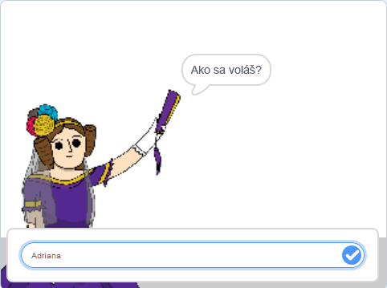
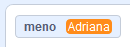
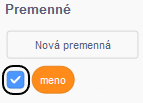
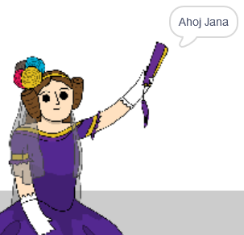

## Povedz Ade svoje meno

Ada sa už predstavila, ale ešte nepozná tvoje meno!

\--- task \---

Presuň blok `otázka`{:class="block3sensing"} (z časti `Zisťovanie`{:class="block3sensing"}) do scenára Ady. Tvoj scenár by mal vyzerať takto:


```blocks3
when this sprite clicked
say [Hi, I'm Ada!] for (2) seconds
+ ask [What's your name?] and wait
```

\--- /task \---

\--- task \---

Vyskúšaj scenár kliknutím na Adu. Ada by sa ťa mala opýtať na tvoje meno, ktoré jej môžeš napísať do poľa v spodnej časti scény!



\--- /task \---

\--- task \---

Pre uloženie mena môžeš použiť **premennú**. Click `Variables`{:class="block3variables"}, and then 'Make a Variable'. Keďže táto premenná bude použitá na uloženie tvojho mena, nazvi premennú... `meno`{:class="block3variables"}!

[[[generic-scratch3-add-variable]]]

\--- /task \---

\--- task \---

To store your name, click the `Variables`{:class="block3variables"} tab, and then drag the `set name`{:class="block3variables"} block onto the end of your code.


```blocks3
when this sprite clicked
say [Hi, I'm Ada!] for (2) seconds
ask [What's your name?] and wait
+ set [name v] to [0]
```

\--- /task \---

\--- task \---

Pre uloženie odpovede, použi blok `odpoveď`{:class="block3sensing"}, ktorý vložíš do bloku "nastav meno".


```blocks3
when this sprite clicked
say [Hi, I'm Ada!] for (2) seconds
ask [What's your name?] and wait
set [name v] to (answer :: +)
```

\--- /task \---

\--- task \---

Kliknutím na Adu vyskúšaj doplnený scenár a na požiadanie zadaj svoje meno. Mal/-a by si vidieť, že tvoje meno je uložené v premennej `meno`{:class="block3variables"}.



\--- /task \---

\--- task \---

Teraz môžeš použiť svoje meno v scenári. Pridaj tento scenár:


```blocks3
when this sprite clicked
say [Hi, I'm Ada!] for (2) seconds
ask [What's your name?] and wait
set [name v] to (answer)
+say (join [Hi ] (name)) for (2) seconds 
```

Postup vytvorenia tohto scenára:

1. Potiahni blok `spoj`{:class="blockoperators"} na blok `bublina`{:class="blocklooks"}
    
    ```blocks3
    say (join [apple] [banana] :: +) for (2) seconds
    ```

2. Pridaj blok premennej `meno`{:class="blockdata"} do bloku `spoj`{:class="blockoperators"}.
    
    ```blocks3
    say (join [Hi] (name :: variables +)) for (2) seconds
    ```

\--- /task \---

\--- task \---

Ak chceš, aby sa premenná `meno`{:class="block3variables"} nezobrazovala na scéne, klikni na modrú značku výberu vedľa premennej v záložke "Scenáre".



\--- /task \---

\--- task \---

Vyskúšaj nový scenár. Ada by ťa mala pozdraviť s použitím tvojho mena!



Ak medzi slovom „Ahoj“ a tvojím menom nie je medzera, musíš do ju scenára v bloku "bublina - spoj" pridať za slovo "Ahoj"!

\--- /task \---

\--- task \---

Nakoniec pridaj tento scenár a vysvetli v ňom, ako pokračovať:


```blocks3
when this sprite clicked
say [Hi, I'm Ada!] for (2) seconds
ask [What's your name?] and wait
set [name v] to (answer)
say (join [Hi ] (name)) for (2) seconds 
+ say [Click the computer to generate a poem.] for (2) seconds 
```

\--- /task \---

\--- task \---

Vyskúšaj si scenár ešte raz, aby si sa uistil/-a, že všetko funguje.

\--- /task \---