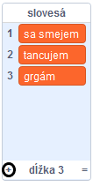
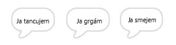

## Analytický stroj

Naprogramujme Adin počítač (nazývaný „analytický stroj“) na generovanie básní.

\--- task \---

Pridaj tento scenár k postave „Počítač“ tak, aby po kliknutí na neho hovoril:


```blocks3
when this sprite clicked
say [Here is your poem...] for (2) seconds
```

\--- /task \---

\--- task \---

Na vytvorenie náhodnej básne, potrebuješ **zoznam** slov, ktoré v nej použiješ. To create a new list, click the `Variables`{:class="block3variables"} tab.

V prvom riadku básne použime **slovesá** (akčné slová). Vytvor nový zoznam, ktorý nazvi `slovesá`{:class="block3variables"}.

[[[generic-scratch3-make-list]]]

\--- /task \---

\--- task \---

Tvoj nový zoznam bude prázdny. Klikni na `+` na spodnej časti prázdneho zoznamu a pridaj tieto slovesá:



\--- /task \---

\--- task \---

V prvom riadku básne by malo byť slovo „Ja“, za ktorým nasleduje náhodné sloveso.

Pre vytvorenie tohto riadku básne musíš:

1. Vyber `náhodne`{:class="block3operators"} číslo od `1` do `dĺžka zoznamu slovesá`{:class="block3variables"}:
    
    ```blocks3
    (pick random (1) to (length of [verbs v]))
    ```

2. Použi tento blok na získanie náhodného `prvku`{:class="block3variables"} zo zoznamu `slovesá`{:class="block3variables"}:
    
    ```blocks3
    (item (pick random (1) to (length of [verbs v]) :: +) of [verbs v])
    ```

3. `Spoj`{:class="block3operators"} "Ja " s náhodne vybraným slovesom na vytvorenie prvého riadku básne:
    
    ```blocks3
    (join [I ] (item (pick random (1) to (length of [verbs v])) of [verbs v] :: +))
    ```

4. Na zobrazenie riadku básne použi blok `bublina`{:class="block3looks"}:
    
    ```blocks3
    say (join [I ](item (pick random (1) to (length of [verbs v])) of [verbs v]) :: +) for (2) seconds
    ```

Tvoj scenár by mal vyzerať takto:


```blocks3
when this sprite clicked
say [Here is your poem...] for (2) seconds
+ say (join [I ](item (pick random (1) to (length of [verbs v])) of [verbs v])) for (2) seconds
```

\--- /task \---

\--- task \---

Párkrát vyskúšaj scenár. Tvoj počítač by mal zakaždým vybrať náhodné slovo zo `slovies`{:class="block3variables"}.



\--- /task \---