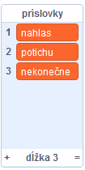
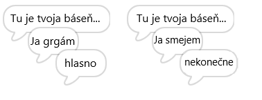
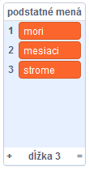
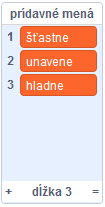
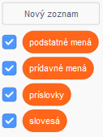

## Viac poézie

Tvoja báseň je pomerne krátka - poďme ju predĺžiť!

\--- task \---

V ďalšom riadku básne použijeme príslovky. **Príslovka** je slovo, ktoré bližšie určuje sloveso. Vytvor ďalší zoznam, ktorý nazveš príslovky a pridaj doň tieto 3 slová:



\--- /task \---

\--- task \---

Pridaj tento riadok do tvojho scenára na vyslovenie náhodnej príslovky v ďalšom riadku tvojej básne:


```blocks3
when this sprite clicked
say [Here is your poem...] for (2) seconds
say (join [I ](item (pick random (1) to (length of [verbs v])) of [verbs v])) for (2) seconds
+say (item (pick random (1) to (length of [adverbs v])) of [adverbs v]) for (2) seconds
```

\--- /task \---

\--- task \---

Párkrát si vyskúšaj scenár. Zakaždým by si mal/-a vidieť náhodnú báseň.



\--- /task \---

\--- task \---

Do tvojho projektu pridaj zoznam podstatných mien. **Podstatné meno** označuje vec alebo jav.



\--- /task \---

\--- task \---

Pridaj scenár, ktorý použije podstatné mená v básni.


```blocks3
when this sprite clicked
say [Here is your poem...] for (2) seconds
say (join [I ](item (pick random (1) to (length of [verbs v])) of [verbs v])) for (2) seconds
say (item (pick random (1) to (length of [adverbs v])) of [adverbs v]) for (2) seconds
+say (join [by the ](item (pick random (1) to (length of [nouns v])) of [nouns v])) for (2) seconds
```

\--- /task \---

\--- task \---

Do tvojho projektu pridaj zoznam prídavných mien. **Prídavné meno** opisuje vlastnosť osôb, zvierat, vecí a javov.



\--- /task \---

\--- task \---

Pridaj scenár, ktorý použije prídavné mená v tvojej básni:


```blocks3
when this sprite clicked
say [Here is your poem...] for (2) seconds
say (join [I ](item (pick random (1) to (length of [verbs v])) of [verbs v])) for (2) seconds
say (item (pick random (1) to (length of [adverbs v])) of [adverbs v]) for (2) seconds
say (join [by the ](item (pick random (1) to (length of [nouns v])) of [nouns v])) for (2) seconds
+ say (join [I feel ](item (pick random (1) to (length of [adjectives v])) of [adjectives v])) for (2) seconds
```

\--- /task \---

\--- task \---

Kliknutím na políčka vedľa zoznamov ich skryješ.



\--- /task \---

\--- task \---

Vyskúšaj si nový scenár.

\--- /task \---