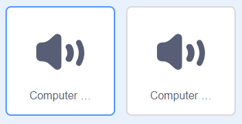

## Animácia analytického stroja

Poďme vytvoriť animáciu postavy počítač tak, aby to vyzeralo, že generuje báseň.

\--- task \---

Klikni na postavu počítač a po prvom bloku `bublina`{:class="block3looks"} pridaj nasledujúci scenár:

Bloky `opakuj`{:class="block3control"} a `čakaj`{:class="block3control"} nájdeš v časti `Riadenie`{:class="block3control"}.


```blocks3
when this sprite clicked
say [Here is your poem...] for (2) seconds
+ repeat (10)
    turn left (5) degrees
    wait (0.1) seconds
    turn right (5) degrees
    wait (0.1) seconds  
end
say (join [I ](item (pick random (1) to (length of [verbs v])) of [verbs v])) for (2) seconds
say (item (pick random (1) to (length of [adverbs v])) of [adverbs v]) for (2) seconds
say (join [by the ](item (pick random (1) to (length of [nouns v])) of [nouns v])) for (2) seconds
say (join [I feel ](item (pick random (1) to (length of [adjectives v])) of [adjectives v])) for (2) seconds
```

\--- /task \---

\--- task \---

Vyskúšaj si scenár. Mal/-a by si vidieť ako sa počítač, predtým než vytvorí báseň, zatrasie!


\--- /task \---

\--- task \---

Klikni na záložku 'Zvuky' a potom klikni vľavo dole na ikonu 'Vyber si zvuk'.

[[[generic-scratch3-sound-from-library]]]

\--- /task \---

\--- task \---

Nájdi zvuk 'Computer beep' a klikni naň.



\--- /task \---

\--- task \---

Pridaj blok `zahraj zvuk`{:class="block3sound"} na zahranie zvuku pred začiatkom animácie.


```blocks3
when this sprite clicked
say [Here is your poem...] for (2) seconds
+ start sound (computer beeps1 v)
repeat (10)
    turn left (5) degrees
    wait (0.1) seconds
    turn right (5) degrees
    wait (0.1) seconds  
end
say (join [I ](item (pick random (1) to (length of [verbs v])) of [verbs v])) for (2) seconds
say (item (pick random (1) to (length of [adverbs v])) of [adverbs v]) for (2) seconds
say (join [by the ](item (pick random (1) to (length of [nouns v])) of [nouns v])) for (2) seconds
say (join [I feel ](item (pick random (1) to (length of [adjectives v])) of [adjectives v])) for (2) seconds
```

\--- /task \---