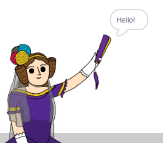

## Ada Lovelace

Leta 1842 je Ada Lovelace pisala o uporabi stroja, imenovanega "analitični stroj" za računanje, zato se jo smatra za prvo računalniško programerko! Ada je bila tudi prva, ki je uvidela, da so računalniki lahko več kot le veliki kalkulatorji.

\--- task \---

Odpri začetni projekt Scratch "Generator poezije".

**Spletna**: odpri [začetni projekt](http://rpf.io/poetry-on){: target = "_ blank"}.

Če imaš Scratch uporabniški račun, lahko ustvariš kopijo s klikom na **Predelaj**.

** Brez povezave ** : odpri začetni projekt [ ](http://rpf.io/p/en/beat-the-goalie-go) {: target = "_ blank"} v namiznem urejevalniku.

Če želiš prenesti in namestiti Namizni Scratch, ga lahko najdeš na [rpf.io/scratchoff](http://rpf.io/scratchoff){: target = "_ blank"}.

\--- /task \---

\--- task \---

Kliknite sprite 'Ada' in v razdelku za kodiranje 'Skripti' kliknite zavihek `Dogodki`{: class = "block3events"}. Povlecite `ko je ta sprite kliknil`{: class = "block3events"} blok na kodirno območje na desni.


Vsaka koda, dodana pod ta blok, se bo začela ob kliku Ade!

\--- /task \---

\--- task \---

Kliknite zavihek `Izgledi`{: class = "block3looks"} in povlecite `recimo`{: class = "block3looks"} `Pozdravljeni!` `za 2 sek.`{: class = "block3looks"} blok pod `ko je ta sprite kliknil`{: class = "block3events"} blok, ki ste ga že dodali.


```blocks3
when this sprite clicked
say [Hello!] for (2) seconds
```

\--- /task \---

\--- task \---

Kliknite na Ado in videli bi jo, kako govori s tabo.



\--- /task \---