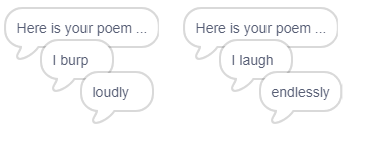

## Више поезије

Ваша песма је прилично кратка - додајмо јој!

\--- task \---

Користимо прилоге у следећем ретку песме. **прилог** је реч која описује глагол. Направите још једну листу која се зове адвербс и додајте ове 3 речи:


\--- /task \---

\--- task \---

Додајте ову линију у шифру свог рачунара, да бисте на следећем ретку песме рекли случајни оглас:


```blocks3
when this sprite clicked
say [Here is your poem...] for (2) seconds
say (join [I ](item (pick random (1) to (length of [verbs v])) of [verbs v])) for (2) seconds
+say (item (pick random (1) to (length of [adverbs v])) of [adverbs v]) for (2) seconds
```

\--- /task \---

\--- task \---

Тестирајте код неколико пута. Сваки пут би требало да видите насумичну песму.



\--- /task \---

\--- task \---

Додајте листу именица у свој пројекат. **именица** је место или ствар.


\--- /task \---

\--- task \---

Додајте код да бисте користили именице у песми.


```blocks3
when this sprite clicked
say [Here is your poem...] for (2) seconds
say (join [I ](item (pick random (1) to (length of [verbs v])) of [verbs v])) for (2) seconds
say (item (pick random (1) to (length of [adverbs v])) of [adverbs v]) for (2) seconds
+say (join [by the ](item (pick random (1) to (length of [nouns v])) of [nouns v])) for (2) seconds
```

\--- /task \---

\--- task \---

Додајте листу придјева у свој пројекат. **придев** је описује реч.


\--- /task \---

\--- task \---

Додајте код да бисте користили придеве у својој песми:


```blocks3
when this sprite clicked
say [Here is your poem...] for (2) seconds
say (join [I ](item (pick random (1) to (length of [verbs v])) of [verbs v])) for (2) seconds
say (item (pick random (1) to (length of [adverbs v])) of [adverbs v]) for (2) seconds
say (join [by the ](item (pick random (1) to (length of [nouns v])) of [nouns v])) for (2) seconds
+ say (join [I feel ](item (pick random (1) to (length of [adjectives v])) of [adjectives v])) for (2) seconds
```

\--- /task \---

\--- task \---

Можете да кликнете на поља поред ваших листа да бисте их сакрили.


\--- /task \---

\--- task \---

Испробајте своју нову песму.

\--- /task \---