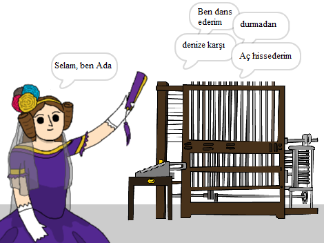

\--- no-print \---

Bu, projenin **Scratch 3** versiyonudur. Ayrıca projenin bir de [Scratch 2 versiyonu](https://projects.raspberrypi.org/en/projects/poetry-generator-scratch2) bulunmaktadır.

\--- /no-print \---

## Giriş

Kendi şiir jeneratörünüzü nasıl programlayacağınızı öğreneceksiniz!

\--- no-print \---

  <iframe allowtransparency="true" width="485" height="402" src="https://scratch.mit.edu/projects/embed/77844926/?autostart=false" frameborder="0" scrolling="no"></iframe>
  

\--- /no-print \---

\--- print-only \---

\--- /print-only \---

## \--- collapse \---

## title: Ne öğreneceksiniz

+ Değişkenler;
+ Listeler ve rastgele liste öğeleri;
+ Tekrarlama ( `tekrar`{: class = "block3control"} bloğu).

\--- /collapse \---

## \--- collapse \---

## title: Nelere ihtiyacınız var

#### Donanım

+ Scratch 3 çalıştırabilen bir bilgisayar

#### Yazılım

+ Scratch 3 ([çevrimiçi](http://rpf.io/scratchon){:target="_blank"} veya [çevrimdışı](http://rpf.io/scratchoff){:target="_blank"})

#### İndirilenler

Başlangıç projesini [burada](http://rpf.io/p/en/poetry-generator-go){:target="_blank"} bulabilirsiniz.

\--- /collapse \---

## \--- collapse \---

## title: Eğitimciler için ek bilgiler

Bu proje [Ada Lovelace](https://findingada.com)Gününü kutlamak için oluşturuldu. Eğer öğretmenseniz, çocukları Ada onun devrim niteliğindeki fikirleriyle tanıştırmak için bir montaj planı da içeren bir Okul Kaynak Paketi indirebilirsiniz ([downloads.codeclub.org.uk/ada.zip](http://downloads.codeclub.org.uk/ada.zip)).

\--- no-print \---

Bu projeyi yazdırmanız gerekiyorsa, lütfen [yazıcı-dostu sürüm](https://projects.raspberrypi.org/en/projects/poetry-generator/print) 'ü kullanın {: target = "_ blank"}.

\--- /no-print \---

Tamamlanmış projeye [buradan](http://rpf.io/p/en/poetry-generator-get){:target="_blank"} ulaşabilirsiniz.

\--- /collapse \---