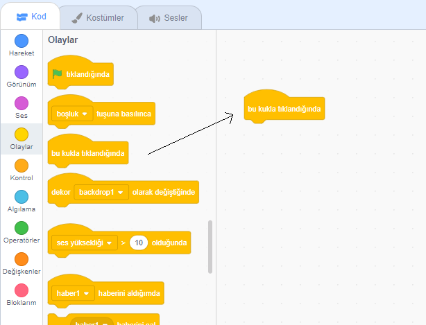
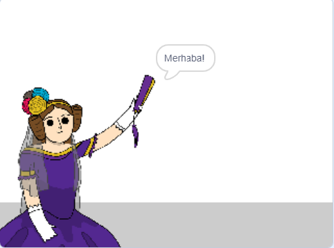

## Ada Lovelace

1842'de Ada Lovelace, hesaplama yapmak için 'Analitik Motor' adı verilen bir makineyi kullandığını yazdı ve dünyanın ilk bilgisayar programcısı olarak görülüyor! Ada, bilgisayarların büyük hesap makinelerinden daha fazlası olabileceğini ilk gören Ada oldu.

\--- task \---

'Şiir Jeneratörü' Scratch başlangıç projesini açın.

**Online**: open the [starter project](https://rpf.io/poetry-on){:target="_blank"}.

Eğer bir Scratch hesabınız varsa, **Remix**'e tıklayarak bir kopyasını oluşturabilirsiniz.

**Offline**: open the [starter project](https://rpf.io/p/en/poetry-generator-go){:target="_blank"} in the offline editor.

If you need to download and install the Scratch offline editor, you can find it at [rpf.io/scratchoff](https://rpf.io/scratchoff){:target="_blank"}.

\--- /task \---

\--- task \---

'Ada' hareketli grafiğinizi tıklayın ve 'Komut Dosyaları' kodlama bölümündeki `Etkinlik`{: class = "block3events"} sekmesini tıklayın. Drag `bu sprite tıklandığında`{: class = "block3events"} bloğu sağdaki kodlama alanı üzerine.

Ada tıklandığında bu bloğun altına eklenen tüm kodlar çalışacaktır!

\--- /task \---

\--- task \---

`Görünüş`{: class = "block3looks"} sekmesini tıklayın ve `say`{: class = "block3looks"} `Merhaba!` `için 2 saniye`Bu hareketli grafik daha önce eklediğiniz</code>{: class = "block3events"} bloğunu tıkladığında `altındaki {{class = "block3looks"} bloğu.

<pre><code class="blocks3">when this sprite clicked
say [Hello!] for (2) seconds
`</pre> 

\--- /task \---

\--- task \---

Ada'ya tıkladığınızda onunla konuşmasını görmelisiniz.

\--- /task \---