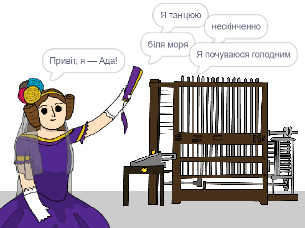

\--- no-print \---

Це — версія проєкту для **Скретч 3**. Також існує [версія проєкту для Скретч 2](https://projects.raspberrypi.org/en/projects/poetry-generator-scratch2).

\--- /no-print \---

## Вступ

Ти навчишся програмувати власний генератор віршів!

\--- no-print \---

  <iframe allowtransparency="true" width="485" height="402" src="https://scratch.mit.edu/projects/embed/77844926/?autostart=false" frameborder="0" scrolling="no"></iframe>
  

\--- /no-print \---

\--- print-only \---

\--- /print-only \---

## \--- collapse \---

## title: Що ти вивчиш

+ Змінні;
+ Списки та випадкові елементи зі списків;
+ Повторення (блок `повторити`{:class="block3control"}).

\--- /collapse \---

## \--- collapse \---

## title: Що тобі знадобиться

#### Обладнання

+ Комп'ютер, що підтримує Скретч 3

#### Програмне забезпечення

+ Скретч 3 (або [онлайн](http://rpf.io/scratchon){:target="_ blank"}, або [офлайн](http://rpf.io/scratchoff){:target="_ blank"})

#### Завантаження

Початковий проєкт можна знайти [тут](http://rpf.io/p/en/poetry-generator-go){:target="_ blank"}.

\--- /collapse \---

## \--- collapse \---

## title: Додаткова інформація для викладачів

Цей проєкт було створено до [Дня Ади Лавлейс](https://findingada.com). If you're a teacher, you can download a School Resource Pack which also contains an assembly plan ([downloads.codeclub.org.uk/ada.zip](http://downloads.codeclub.org.uk/ada.zip)), to introduce children to Ada and her revolutionary ideas.

\--- no-print \---

Якщо вам потрібно роздрукувати цей проєкт, будь ласка, скористайтеся [версією для друку](https://projects.raspberrypi.org/en/projects/poetry-generator/print){:target="_blank"}.

\--- /no-print \---

Ви можете знайти [завершений проєкт тут](http://rpf.io/p/en/poetry-generator-get){:target="_ blank"}.

\--- /collapse \---