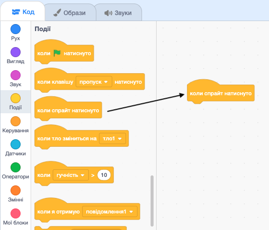
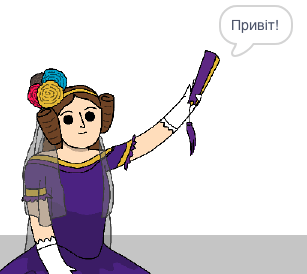

## Ада Лавлейс

У 1842 році Ада Лавлейс писала про використання для розрахунків машини, яка називалася "Аналітична машина", і вона вважається першим у світі комп'ютерним програмістом! Ада також першою передбачила, що комп'ютери можуть бути не просто великими калькуляторами.

--- task ---

Відкрий початковий проєкт "Генератор віршів".

**Онлайн**: відкрий [початковий проєкт](https://scratch.mit.edu/projects/382940929){:target="_blank"}.

Якщо у тебе є обліковий запис Скретч, то ти можеш зробити копію проєкту, натиснувши **Ремікс**.

**Офлайн**: відкрий [початковий проєкт](http://rpf.io/p/uk-UA/beat-the-goalie-go){:target="_blank"} в офлайн-редакторі.

Якщо тобі треба завантажити та встановити офлайн-редактор Скретч, то ти можеш його знайти на [rpf.io/scratchoff](http://rpf.io/scratchoff){:target="_blank"}.

--- /task ---

--- task ---

Клацни на спрайт "Ада" та перейди у вкладку `Події`{:class="block3events"} у розділі "Код". Перетягни блок `коли спрайт натиснуто`{:class="block3events"} в область коду праворуч.




Будь-який код, доданий під цим блоком, буде запущено, коли клацнути на Аду!

--- /task ---

--- task ---

Перейди у вкладку `Вигляд`{:class="block3looks"} і перетягни блок `говорити`{:class="block3looks"} `Привіт!` `2 сек`{:class="block3looks"} під вже доданий блок `коли спрайт натиснуто`{:class="block3events"}.


```blocks3
when this sprite clicked
say [Привіт!] for (2) seconds
```

--- /task ---

--- task ---

Клацни на Аду, і ти побачиш, як вона розмовляє з тобою.



--- /task ---