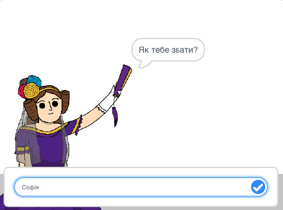
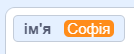
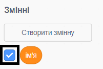
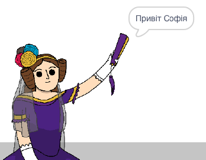

## Скажи Аді своє ім’я

Ада представилася, але вона не знає твого імені!

--- task ---

Перетягни блок `запитати`{:class="block3sensing"} (з розділу `Датчики`{:class="block3sensing"}) у свій код. Ось як має виглядати твій код:


```blocks3
when this sprite clicked
say [Привіт, я — Ада!] for (2) seconds
+ ask [Як тебе звати?] and wait
```

--- /task ---

--- task ---

Клацни на Аду, щоб перевірити свій код. Ада має запитати яке твоє ім’я, а ти можеш його ввести!



--- /task ---

--- task ---

Ми можемо використовувати **змінну** для зберігання твого імені. Натисни `Змінні`{:class="block3variables"}, а далі — "Створити змінну". Оскільки ця змінна буде використовуватися для зберігання твого імені, давай назвемо її... `ім’я`{:class="block3variables"}!

[[[generic-scratch3-add-variable]]]

--- /task ---

--- task ---

Щоб зберегти своє ім’я, перейди у вкладку `Змінні`{:class="block3variables"} і перетягни блок `надати ім’я значення`{:class="block3variables"} в кінець твого коду.


```blocks3
when this sprite clicked
say [Привіт, я — Ада!] for (2) seconds
ask [Як тебе звати?] and wait
+ set [ім’я v] to [0]
```

--- /task ---

--- task ---

Використовуй блок `відповідь`{:class="block3sensing"}, щоб отримати доступ до введеного тобою значення.


```blocks3
when this sprite clicked
say [Привіт, я — Ада!] for (2) seconds
ask [Як тебе звати?] and wait
set [ім’я v] to (answer :: +)
```

--- /task ---

--- task ---

Клацни на Аду для перевірки коду і введи своє ім’я, коли запитають. Ти маєш побачити, як твоє ім’я було збережено в змінній `ім’я`{:class="block3variables"}.



--- /task ---

--- task ---

Тепер ти можеш використовувати своє ім’я в коді. Додай цей код:


```blocks3
when this sprite clicked
say [Привіт, я — Ада!] for (2) seconds
ask [Як тебе звати?] and wait
set [ім’я v] to (answer)
+say (join [Привіт ] (ім’я)) for (2) seconds 
```

Щоб створити цей код:

1. Перетягни блок `з’єднати`{:class="blockoperators"} в блок `говорити`{:class="blocklooks"}
    
    ```blocks3
    say (join [apple] [banana] :: +) for (2) seconds
    ```

2. Додай блок `ім’я`{:class="blockdata"} в блок `з’єднати`{:class="blockoperators"}.
    
    ```blocks3
    say (join [Привіт] (ім’я :: variables +)) for (2) seconds
    ```

--- /task ---

--- task ---

Щоб прибрати змінну `ім’я`{:class="block3variables"} зі сцени, клацни на галочку поруч зі змінною.



--- /task ---

--- task ---

Перевір свій код. Ада повинна з тобою привітатися по імені!



Якщо між словом "Привіт" та твоїм іменем немає пропуску, тобі треба додати його в код самостійно!

--- /task ---

--- task ---

Нарешті, додай код, що пояснює подальші дії:


```blocks3
when this sprite clicked
say [Привіт, я — Ада!] for (2) seconds
ask [Як тебе звати?] and wait
set [ім’я v] to (answer)
say (join [Привіт ] (ім’я)) for (2) seconds 
+ say [Натисни на комп’ютер, щоб згенерувати вірш.] for (2) seconds 
```

--- /task ---

--- task ---

Перевір код Ади востаннє, щоб впевнитися, що все працює.

--- /task ---