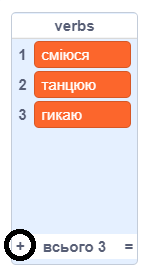
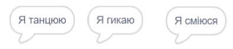

## Аналітична машина

Давай запрограмуємо комп’ютер Ади (що називається "Аналітична машина") для генерації віршів.

--- task ---

Додай цей код до свого спрайта "Комп’ютер", щоб він говорив, якщо клацнути на нього:


```blocks3
when this sprite clicked
say [Ось твій вірш...] for (2) seconds
```

--- /task ---

--- task ---

Для створення випадкового вірша, спочатку тобі потрібен **список** слів, які можна використовувати. Для створення нового списку, перейди у вкладку `Змінні`{:class="block3variables"}.

Давай будемо використовувати **дієслова** у першому рядку вірша. Створи новий список із назвою `дієслова`{:class="block3variables"}.

[[[generic-scratch3-make-list]]]

--- /task ---

--- task ---

Твій новий список буде порожнім. Клацни на `+` внизу свого порожнього списку, щоб додати наступні дієслова:



--- /task ---

--- task ---

Перший рядок вірша має починатися зі слова "Я", за яким іде випадкове дієслово.

Для створення такого рядка вірша, тобі треба:

1. Вибрати `випадкове`{:class="block3operators"} значення між `1` та `довжиною списка дієслова`{:class="block3variables"}:
    
    ```blocks3
    (pick random (1) to (length of [дієслова v]))
    ```

2. Використати наступний блок, щоб отримати випадковий `елемент`{:class="block3variables"} із списку `дієслова`{:class="block3variables"}:
    
    ```blocks3
    (item (pick random (1) to (length of [дієслова v]) :: +) of [дієслова v])
    ```

3. `З’єднати`{:class="block3operators"} "Я " з випадковим дієсловом для створення першого рядка вірша:
    
    ```blocks3
    (join [Я ] (item (pick random (1) to (length of [дієслова v])) of [дієслова v] :: +))
    ```

4. Використати блок `говорити`{:class="block3looks"}, щоб відобразити рядок вірша:
    
    ```blocks3
    say (join [Я ](item (pick random (1) to (length of [дієслова v])) of [дієслова v]) :: +) for (2) seconds
    ```

Твій код повинен виглядати так:


```blocks3
when this sprite clicked
say [Ось твій вірш...] for (2) seconds
+ say (join [Я ](item (pick random (1) to (length of [дієслова v])) of [дієслова v])) for (2) seconds
```

--- /task ---

--- task ---

Перевір свою програму кілька разів. Твій комп’ютер кожного разу повинен вибирати випадкове слово із списку `дієслова`{:class="block3variables"}.



--- /task ---