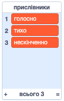
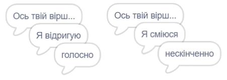
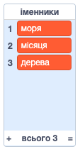
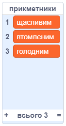
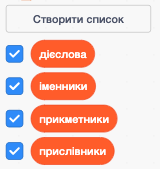

## Більше поезії

Твій вірш досить короткий, давай його доповнимо!

\--- task \---

Давай використаємо прислівники в наступному рядку твого вірша. **Прислівник** — це слово, яке описує дієслово. Створи ще один список з назвою "прислівники" і додай наступні 3 слова:



\--- /task \---

\--- task \---

Додай наступний рядок до коду комп’ютера, щоб він сказав випадковий прислівник в наступному рядку твого вірша:


```blocks3
when this sprite clicked
say [Here is your poem...] for (2) seconds
say (join [I ](item (pick random (1) to (length of [verbs v])) of [verbs v])) for (2) seconds
+say (item (pick random (1) to (length of [adverbs v])) of [adverbs v]) for (2) seconds
```

\--- /task \---

\--- task \---

Перевір свою програму кілька разів. Кожного разу ти маєш бачити випадковий вірш.



\--- /task \---

\--- task \---

Додай список іменників до свого проєкту. **Іменник** — це місце або предмет.



\--- /task \---

\--- task \---

Додай код для використання іменників в своєму вірші.


```blocks3
when this sprite clicked
say [Here is your poem...] for (2) seconds
say (join [I ](item (pick random (1) to (length of [verbs v])) of [verbs v])) for (2) seconds
say (item (pick random (1) to (length of [adverbs v])) of [adverbs v]) for (2) seconds
+say (join [by the ](item (pick random (1) to (length of [nouns v])) of [nouns v])) for (2) seconds
```

\--- /task \---

\--- task \---

Додай список прикметників до свого проєкту. **Прикметник** — це слово, що описує іменник.



\--- /task \---

\--- task \---

Додай код для використання прикментників в своєму вірші:


```blocks3
when this sprite clicked
say [Here is your poem...] for (2) seconds
say (join [I ](item (pick random (1) to (length of [verbs v])) of [verbs v])) for (2) seconds
say (item (pick random (1) to (length of [adverbs v])) of [adverbs v]) for (2) seconds
say (join [by the ](item (pick random (1) to (length of [nouns v])) of [nouns v])) for (2) seconds
+ say (join [I feel ](item (pick random (1) to (length of [adjectives v])) of [adjectives v])) for (2) seconds
```

\--- /task \---

\--- task \---

Ти можеш клацнути на квадратики поруч зі своїми списками, щоб їх сховати.



\--- /task \---

\--- task \---

Перевір свій новий вірш.

\--- /task \---