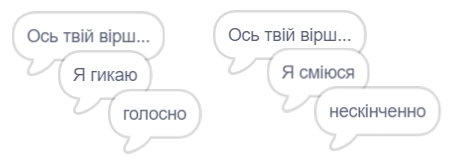

## Більше поезії

Твій вірш досить короткий, давай його доповнимо!

--- task ---

Давай використаємо прислівники в наступному рядку твого вірша. **Прислівник** — це слово, яке описує дієслово. Створи ще один список з назвою "прислівники" і додай наступні 3 слова:


--- /task ---

--- task ---

Додай наступний рядок до коду комп’ютера, щоб він сказав випадковий прислівник в наступному рядку твого вірша:


```blocks3
when this sprite clicked
say [Ось твій вірш...] for (2) seconds
say (join [Я ](item (pick random (1) to (length of [дієслова v])) of [дієслова v])) for (2) seconds
+say (item (pick random (1) to (length of [прислівники v])) of [прислівники v]) for (2) seconds
```

--- /task ---

--- task ---

Перевір свою програму кілька разів. Кожного разу ти маєш бачити випадковий вірш.



--- /task ---

--- task ---

Додай список іменників до свого проєкту. **Іменник** — це місце або предмет.


--- /task ---

--- task ---

Додай код для використання іменників в своєму вірші.


```blocks3
when this sprite clicked
say [Ось твій вірш...] for (2) seconds
say (join [Я ](item (pick random (1) to (length of [дієслова v])) of [дієслова v])) for (2) seconds
say (item (pick random (1) to (length of [прислівники v])) of [прислівники v]) for (2) seconds
+say (join [біля ](item (pick random (1) to (length of [іменники v])) of [іменники v])) for (2) seconds
```

--- /task ---

--- task ---

Додай список прикметників до свого проєкту. **Прикметник** — це слово, що описує іменник.


--- /task ---

--- task ---

Додай код для використання прикментників в своєму вірші:


```blocks3
when this sprite clicked
say [Ось твій вірш...] for (2) seconds
say (join [Я ](item (pick random (1) to (length of [дієслова v])) of [дієслова v])) for (2) seconds
say (item (pick random (1) to (length of [прислівники v])) of [прислівники v]) for (2) seconds
say (join [біля ](item (pick random (1) to (length of [іменники v])) of [іменники v])) for (2) seconds
+ say (join [Я почуваюся ](item (pick random (1) to (length of [прикметники v])) of [прикметники v])) for (2) seconds
```

--- /task ---

--- task ---

Ти можеш клацнути на квадратики поруч зі своїми списками, щоб їх сховати.


--- /task ---

--- task ---

Перевір свій новий вірш.

--- /task ---